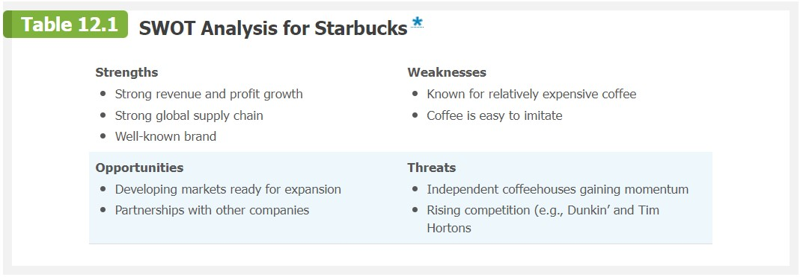
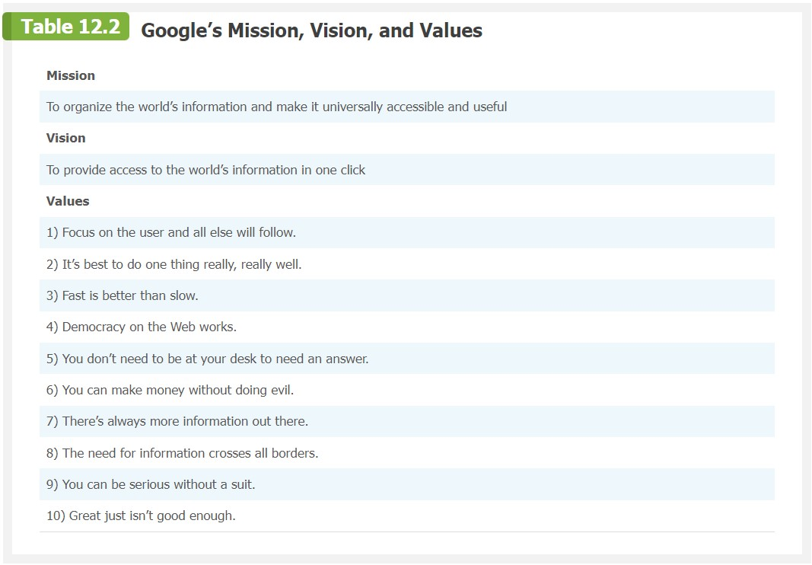

> This, said Theuth, will make the Egyptians wiser and give them better memories; it is a specific both for the memory and for the wit. Thamus replied: O most ingenious Theuth, the parent or inventor of an art is not always the best judge of the utility or inutility of his own inventions to the users of them. And in this instance, you who are the father of letters, from a paternal love of your own children have been led to attribute to them a quality which they cannot have; for this discovery of yours will create forgetfulness in the learners' souls, because they will not use their memories; they will trust to the external written characters and not remember of themselves. The specific which you have discovered is an aid not to memory, but to reminiscence, and you give your disciples not truth, but only the semblance of truth; they will be hearers of many things and will have learned nothing; they will appear to be omniscient and will generally know nothing; they will be tiresome company, having the show of wisdom without the reality. \
> --Socrates recounting the gift of letters offered by Ammon

<iframe class="center" width="560" height="315" src="https://www.youtube.com/embed/qTmPrVhdtks?si=8Z9CK1dP1vPdgcQv" title="YouTube video player" frameborder="0" allow="accelerometer; autoplay; clipboard-write; encrypted-media; gyroscope; picture-in-picture; web-share" allowfullscreen></iframe>

## Announcements

- Review pesentation psections / protocol

## Agenda

- Prof saves face by running OCR demo
  - brief review of NN model release; train vs predict
- Lecture
- Discussion

# Artificial Intelligence

## Types of AI

### Expert Systems

Simulate human intelligence...

- Are a form of AI.
  - _No active learning by machine_.
  - _Rely upon predefined rules_.

~~fig(60){https://static.javatpoint.com/tutorial/ai/images/expert-systems-in-ai.png}

- **_Frequent firing of a neuron strengthens the synapse between connected neurons._**
  - Synaptic distance decreases; "tighter" connection along circuit.
  - Close synapses are more likely to fire together.
  - Aids in memory formation.

#### Artificial Neural Networks

- Inputs are called "features" or "parameters"
- Each layer behaves like a function, transforming the previous layer.
- Complexity of function that can be learned depends on the architecture that’s used.

##### Single layer perceptron

<!-- https://towardsdatascience.com/everything-you-need-to-know-about-neural-networks-and-backpropagation-machine-learning-made-easy-e5285bc2be3a -->

- What can it compute?
  - Linear functions - where output groupings (true or false) can be separated by a line.
  - E.g. AND - yes; XOR - no

~~fig(90){https://static.packt-cdn.com/products/9781788299879/graphics/2271a103-bcc0-4ea0-acca-0eb3e3c99fbd.png}

### Suppliers

- How do these elements increase or decrease bargaining power of org?
  - Current supply
  - Forecasted supply
  - Availability / scarcity of materials
  - Supplier / vendor "lock in"
- Vertical expansion
  - Buying up suppliers (acquisitions)
  - Launch new company / division to supply
  - Examples?
    - Amazon - AWS
      - Warehouses, Delivery, Banking, AWS
        - Servers, Circuitry, Cabling, Cooling and power, ...
    - Tesla
      - Battery, Solar, AI, Electronics, etc.
      - [Acquisitions by Tesla](https://tracxn.com/d/acquisitions/acquisitions-by-tesla/__z7iBA0j3piGy5SjdQFAYgeC06G3Q2ntcoN1vYCcRsVg)

Case study:

**Tesla**

<iframe width="560" height="315" src="https://www.youtube.com/embed/OhiqWTwz1uk?si=9TiZQ-dU6dTdwNnU" title="YouTube video player" frameborder="0" allow="accelerometer; autoplay; clipboard-write; encrypted-media; gyroscope; picture-in-picture; web-share" allowfullscreen></iframe>

- ~0:50 - Market-entry strategy (2008)
  - Didn't go for mass adoption product
  - Went for high-end, high-margin product: Roadster
- ~4:15 Later scaling toward mass-market
  - Model S
  - Model X
  - Model 3...
- ~2:00 - Direct distribution model
  - Manufacturing to customer; whole process is Tesla
  - No dealerships; online sales and Tesla physical stores (like Apple stores)
- Fits with overall Musk bootstrapping strategy
  - PayPal (2002) -> Tesla (2003) -> SpaceX (2002)

<figure>
    
        
    
    <figcaption>
        <a href="https://wwwkunlastree.blogspot.com/2017/07/elon-musk-net-worth-over-time.html">Prof source note: seems opinionated; I didn't have time to audit for accuracy.</a>
    </figcaption>
</figure>

- Could most startups work with this high vertical integration model?
  - Takes a lot of capital...

Case study:

**nVidia and GPU Market**

- Industries scrambling to create/employ AI plan
- Huge demand, low supply
- Rivalry / competitors in ramp up mode
- Who profits?

  - Are these profits tenable long term?

- Currently, there are linear profits for linear scaling in compute
- Will there be a "compute bust"?
- Responses to need for massive compute power...
  - Efficient algorithms
  - Compression

### Substitutes

- Different product / service, but accomplishes same goal for consumer.
- How does this affect strategy of org?
- Examples?
  - Uber vs. taxi
  - Netflix vs. cable
  - e-books vs. paper books
  - ...

### Competitors

- Competitors offering a product with little differentiation.
- Strategies to set my product apart?
  - Price
  - Quality
  - Service
  - Branding

### Potential Entrants

- **_Barriers to entry_** = factors that make it difficult for new competitors to enter the market.
  - Capital
    - Can't raise initial funding to start
  - Expertise
    - Can't afford to hire experts
  - Monopoly
    - Supply locked
    - Can't compete with prices
    - Can't compete with branding

Case study:

**AI Software and Hardware Architechtures**

- Started off niche
- Odd position where "products" are not yet defined;
  - Exploritory investment
- Major tech leaders, e.g. Meta, now open sourcing how to do things
- How does this influence barrier to entry?
  - Startups?
  - Good or bad for innovation?

### Buyers

- Who is my market?
  - Niche?
  - One size fits all (enterprise)?
- How does this affect strategy?
  - How much to produce?
  - How much to charge?
- Forecasting demand
  - How much risk am I taking?
  - Flexibility
    - Can I scale up / down quickly?
    - Can I pivot quickly?
  - Reactive / cautious approach vs speculative approach?
    - Advantage to being first to market?
- How is this affected by...
  - Novel product vs. existing product?
  - Startup vs. established company?

### Summarizing: SWOT Analysis

SWOT = Strengths, Weaknesses, Opportunities, Threats

<figure>
    
        
    
    <figcaption>
        SWOT Analysis - Starbucks
    </figcaption>
</figure>

## Mission, Vision, Core Values

### Mission

- **Mission statement** = What is the ultimate goal and purpose of the organization?
- Concise, clear, and inspiring.

<figure>
    
        
    
    <figcaption>
        <a href="https://www.ebaqdesign.com/blog/mission-statements">Mission Statements of Top Brands</a>
    </figcaption>
</figure>

### Vision

- **Vision statement** = What does the organization hope to achieve?
- More to do with external goals than internal culture.

<figure>
    
        
    
    <figcaption>
        <a href="https://www.ebaqdesign.com/blog/vision-statements">Vision Statements of Top Brands</a>
    </figcaption>
</figure>

### Core Values

- **Core values** = What are the guiding principles of the organization?
- More to do with internal culture than external goals.
- Used to attract and retain employees.

<figure>
    
        
    
    <figcaption>
        
    </figcaption>
</figure>

## Goals and Objectives

### SMART Goals

**_SMART_** = Specific, Measurable, Attainable, Relevant, Time constrained

- Specific
  - Who, what, where, when, why, how?
- Measurable
  - What is your metric to know you've reached it?
- Attainable
  - Is it realistic (feasible in business lingo)?
- Relevant
  - Does it align with your mission, vision, and core values?
- Time constrained
  - Have you set a specific deadline or milestones?

## Staying Current on Innovation

- MS Build convention, Satya Nadella and others, Microsoft

  - [Microsoft Build 2023](https://news.microsoft.com/build-2023/)

    <iframe width="560" height="315" src="https://www.youtube.com/embed/FaV0tIaWWEg?si=p7Z10SGF9KC5Tkmf" title="YouTube video player" frameborder="0" allow="accelerometer; autoplay; clipboard-write; encrypted-media; gyroscope; picture-in-picture; web-share" allowfullscreen></iframe>

- Andrej Karpathy, Tesla / OpenAI

<iframe width="560" height="315" src="https://www.youtube.com/embed/bZQun8Y4L2A?si=0hnLcMHB6GZwOzgT" title="YouTube video player" frameborder="0" allow="accelerometer; autoplay; clipboard-write; encrypted-media; gyroscope; picture-in-picture; web-share" allowfullscreen></iframe>

- Chamath Palihapitiya, Social Capital

<iframe width="560" height="315" src="https://www.youtube.com/embed/wgYZk9Mc804?si=7tO8iTZSJVg9WT4N" title="YouTube video player" frameborder="0" allow="accelerometer; autoplay; clipboard-write; encrypted-media; gyroscope; picture-in-picture; web-share" allowfullscreen></iframe>

**_Find a medium and personality that's comfortable for you - stay current!_**
