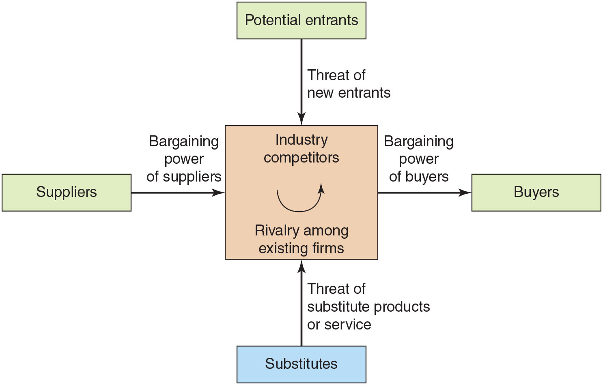

> This, said Theuth, will make the Egyptians wiser and give them better memories; it is a specific both for the memory and for the wit. Thamus replied: O most ingenious Theuth, the parent or inventor of an art is not always the best judge of the utility or inutility of his own inventions to the users of them. And in this instance, you who are the father of letters, from a paternal love of your own children have been led to attribute to them a quality which they cannot have; for this discovery of yours will create forgetfulness in the learners' souls, because they will not use their memories; they will trust to the external written characters and not remember of themselves. The specific which you have discovered is an aid not to memory, but to reminiscence, and you give your disciples not truth, but only the semblance of truth; they will be hearers of many things and will have learned nothing; they will appear to be omniscient and will generally know nothing; they will be tiresome company, having the show of wisdom without the reality. \
<span class="attr">--Socrates recounting the gift of letters offered by Ammon</span>

<iframe class="center" width="560" height="315" src="https://www.youtube.com/embed/qTmPrVhdtks?si=8Z9CK1dP1vPdgcQv" title="YouTube video player" frameborder="0" allow="accelerometer; autoplay; clipboard-write; encrypted-media; gyroscope; picture-in-picture; web-share" allowfullscreen></iframe>


## Announcements

- Review pesentation psections / protocol

## Agenda

- Prof saves face by running OCR demo
    - brief review of NN model release; train vs predict 
- Lecture
- Discussion

# Artificial Intelligence

## Types of AI

### Expert Systems

Simulate human intelligence...

- Are a form of AI.
    - _No active learning by machine_.
    - _Rely upon predefined rules_.

<figure>
    <span>
        
    </span>
    <figcaption>
        <a href="https://www.javatpoint.com/expert-systems-in-artificial-intelligence">What is an Expert System?</a>
    </figcaption>
</figure>

- Also called "knowledge based systems".
- Support decision making via a set of **_business rules_** for a domain.
    - Business rules = the logic (if this input, then do that...).
    - Software devs consult with **domain experts** to implement the business rules (the logic of the programs).
    - Set of rules can be complex, and requires multiple parties to develop.
- Popular in the 1980s and 1990s. Still used.
    - In many cases, expert systems of the past are being updated to use modern AI/ML techniques.

#### How are Decisions Made?

- Classic logical branching and rule-based reasoning to support decision-making.
- The logic rulse are **_explicitly_** coded into the program by software devs.
- Are **_deterministic_** - the same input will always produce the same output.
    - Think of a flowchart...

#### Key Componenets

- Knowledge base
    - The rules of the system.
    - The logic of the system.
- Inference engine
    - The part of the system that applies the rules to the input and produces output.
- User interface
    - The part of the system that the user sees and interacts with.

#### Domain Examples

**_Domain_** = a specific area of knowledge, activity, or thought. E.g.:

- Tax preparation
- Financial analysis
- Legal research and contract review
- Medical diagnosis
- Engineering design
- Industrial and manufacturing systems
- Customer support troubleshooting
- ...

### Machine Learning Systems

Simulate human intelligence...

- Are a form of AI.
    - _Learn rules without being explicity programmed_.

- Used to solve problems that...
    - Are too complex for a human to solve.
    - Would take a human hours, days, or years to solve.

- Have come to popularity due to
    - Big data
        - Advances in data collection
        - Advances in data storage
    - Advances in computing power / efficiency
        - Cloud computing
        - GPU computing
    - Advances in algorithms
        - Neural networks
        - Deep learning
        - Reinforcement learning
        - ...

What do they all have in common?

#### How are Decisions Made?

- Many different types of ML algorithms. We will cover these briefly below...

#### Domain Examples

- Image recognition
- Speech recognition
- Natural language processing
- Fraud detection
- Recommendation systems
- ...

## Terminology and Algorithm Types 

The outline below shows which terms are subsets of other terms. We will pick these apart...

- **_Artificial intelligence_** = the simulation of human intelligence by machines.
    - **_Expert systems_** = a form of AI that uses predefined rules to make decisions.
    - **_Machine learning_** = the ability of a machine to learn without being explicitly programmed.
        - **_Supervised learning_** = a machine learning technique that uses labeled data to train a model.
        - **_Unsupervised learning_** = a machine learning technique that uses unlabeled data to train a model.
        - **_Reinforcement learning_** = a machine learning technique that uses rewards to train a model.


| Algorithm                | Type of Learning | Type of Output         |
| ------------------------ | ---------------- | ---------------------- |
| Linear Regression        | Supervised       | Continuous             |
| Logistic Regression      | Supervised       | Discrete               |
| Decision Tree            | Supervised       | Discrete               |
| Support Vector Machine   | Supervised       | Discrete               |
| Neural Network           | Supervised       | Continuous or Discrete |
| Clustering               | Unsupervised     | Discrete               |
| Dimensionality Reduction | Unsupervised     | Continuous             |
| Reinforcement Learning   | Reinforcement    | Continuous or Discrete |

These are the _typical_ uses of these algorithms. They can be adapted.

### Output Types

#### Continuous

- *prediction* 
- value that can be any number.
- E.g.
    - predicting the price of a house
    - predicting the number of sales
    - predicting the number of customers

#### Discrete

- *classification*
- value is in a specific set.
    - Typically { true, false }
- E.g.
    - predicting whether a tumor is malignant
    - predicting whether a loan will default
    - predicting whether a customer will buy a produc   t

### Learning Types

#### Supervised Learning

The "correct answer" is given to the machine.

- Uses **_labeled_** data to train a model.
- First give the model a "training set" of data.
    - Data that has been labeled with the correct answer.
- After training, model can generalize to examples that it has not seen before.
    - Data that has not been labeled.

##### Examples

###### Linear Regression

- Has been around since the 1800s.
- Still very widely used today.
- Comes up with coefficients for a linear equation that best fits the data.

E.g:

```
## y is prediction
## x values are new inputs
## a values are coefficients from trained model
y = b + a1x1 + a2x2 + a3x3 + ...
```

###### Neural Networks

... These get their own section below ...

#### Unsupervised Learning

There is no "answer".

- Extracts patterns from data.
- Use for data exploration.
- Use for data visualization.
- Use for data compression.
- Use for data denoising.

##### Examples

###### Clustering

- Grouping data into clusters (groups).
- Which data points in the set are similar?
- E.g. grouping customers by purchasing behavior.
    - Market segmentation
        - Targeted marketing
        - Product development
        - Pricing

###### Dimensionality reduction (compression)

- Reducing the number of features in a dataset.
- E.g. reducing the number of features in a dataset.

###### Anomaly detection

- Identifying outliers in a dataset.
- E.g. identifying fraudulent transactions.

###### Association rule learning

- Identifying relationships between variables in a dataset.
- E.g. identifying which products are frequently purchased together.
    - Market basket analysis
    - Data mining legend: beer and diapers

#### Reinforcement Learning (RL)

- Nobody is giving the machine the correct answer.
- Receives reward when some objective is met.
- Uses reward signal to reinforce goal oriented behavior.

Think of a rat finding food in a maze, where food is always in the same spot:

- food sends reward signal to rat brain
- eventually, rat learns the optimal path to the food
- nobody "told" the rat how to find the food.

## Neural Networks

### History

- 1950s
    - Frank Rosenblatt is credited with the invention of the perceptron in 1957.
- 1960s
    - Marvin Minsky and Seymour Papert publish 1969 book that showing limitations perceptron (single layer network)
        - Declined interest after that
        - Minsky keeps at it
- 1980s
    - Backpropagation algorithm was invented.
    - Allowed for training of multi-layer perceptrons.
    - Renewed interest.
- 2000s, 2010s
    - Deep learning
    - GPUs
    - Big data
    - Cloud computing
- 2020s
    - Large Language Models (LLMs)
    - Everybody wants a piece of the pie

### Architectures 

#### Biological Neural Networks 

Memory and learning in the brain.

<figure>
    <span>
        
    </span>
    <figcaption>
        <a href="https://www.simplypsychology.org/synapse.html">What Is A Synapse?</a>
    </figcaption>
</figure>

- **_Frequent firing of a neuron strengthens the synapse between connected neurons._**
    - Synaptic distance decreases; "tighter" connection along circuit.
    - Close synapses are more likely to fire together.
    - Aids in memory formation.

#### Artificial Neural Networks

- Inputs are called "features" or "parameters"
- Each layer behaves like a function, transforming the previous layer.
- Complexity of function that can be learned depends on the architecture that’s used.

##### Single layer perceptron

<!-- https://towardsdatascience.com/everything-you-need-to-know-about-neural-networks-and-backpropagation-machine-learning-made-easy-e5285bc2be3a -->

- What can it compute?
    - Linear functions - where output groupings (true or false) can be separated by a line.
    - E.g. AND - yes; XOR - no

<figure>
    <span>
        
    </span>
    <figcaption>
        <a href="https://subscription.packtpub.com/book/data/9781788299879/12/ch12lvl1sec62/nonlinear-decision-boundaries">Nonlinear decision boundaries</a>
    </figcaption>
</figure>

<p class="demo">Demo:</p>

[nn_logical_and_step.py](https://github.com/mpjovanovich/ivy_tech/blob/main/demos/nn_logical_and_step.py)

##### Deep Networks / Multi-layer Perceptron

Just adds more layers. Each layer is a function that transforms the previous layer.

<figure>
    <span>
        
    </span>
    <figcaption>
        <a href="https://www.quantib.com/blog/how-does-deep-learning-work-in-radiology">How does deep learning in radiology work?</a>
    </figcaption>
</figure>

<figure>
    <span>
        
    </span>
    <figcaption>
        <a href="https://prince-canuma.medium.com/understanding-neural-networks-22b29755abd9">Example Training of NN</a>
    </figcaption>
</figure>

<p class="demo">Demo:</p>

The above demo (logical and) didn't allow us to generalize to new data. Let's try a more complex problem:

- Draw a word on the screen and save as an image.
- See if pretrained NN can recognize the word.
- [python_easyocr.py](https://github.com/mpjovanovich/ivy_tech/blob/main/demos/OCR/python_easyocr.py)


##### Other Architectures

- Today's architectures use techniques to represent structure in the data. e.g.:
    - Temporal loops
    - Attention mechanisms
    - ...

### Generative AI

- AI that can create new content.
- E.g. 
    - Language models: GPT-4, MT-NLG, LaMDA, Chinchilla AI, LLaMA
    - Image generation models: DALL-E 2, Stable Diffusion, Midjourney v5I
    - Code assistants: GitHub Copilot, TabNine, Kite
    - Other models: PaLM, Megatron-Turing NLG, Cosmos-1, Jurassic-1 Jumbo, Wu Dao 2.0

<p class="demo">Demo: </p>

ChatGPT

- Limits of ChatGPT
    - Knowledge cutoff
    - Awareness of self
        - Does not "know" what it's doing; just predicting words.
- How to get good results
    - Use highly descriptive prompts.
    - Embed examples into the prompt.
    - Use iterative development (it can re-read its content and do better).

## Business Use Cases for ML in the Near Future

### Analytics

Businesses are already using quantitative analytics to make decisions.

As ML gets better, businesses will invest more in this.

- Predictive analytics
    - Predicting future events based on historical data.
    - E.g. predicting customer attrition.
- Prescriptive analytics
    - Recommending actions based on predictions.
    - E.g. recommending a discount to a customer to prevent attrition.
- Descriptive analytics
    - Summarizing historical data.
    - E.g. summarizing customer attrition over the past year.
- Diagnostic analytics
    - Explaining why something happened.
    - E.g. explaining why customer attrition increased last month.

### Chatbots / Assistants

Businesses will be quick to adopt chatbots for customer service and support, both internal and external to org.

- Fine-tuned models
    - Take base model and train it on a specific domain.
    - Essentially, you are training it to be an expert system.
- Altered system prompt
    - Change its personality and goal.
    - <span class="demo">demo:</span>
        - [custom_chatbot.py](https://github.com/mpjovanovich/openai_playground/blob/main/custom_chatbot.py)

## AI and Jobs

### Will computers.. take… our… jobs?

### Jobs at risk…

- Repetitive work that can be automated
    - Billing
    - Clerical / secretarial
    - Product support
    - Programming / software

- Some generative AI now doing creative work
    - Visual and audio
    - New (ft. John Lennon) · Paul McCartney \[AI\]
    - John’s voice is AI

### Outcomes

- Short term:
    - Society has always been able to upskill the work force to accommodate for changes in technology, e.g. industrial revolution
    - AI are not yet close to being able to do what a human can do.
    - We need people to develop and maintain AI.

- Long term:
    - Looking like AI will be able to do anything humans can _currently_ do, and more.
    - Job displacement may require economic restructuring.
    - Optimistic view
        - **_Synthesis between humans and AI will empower humans to further human-centric goals and ideals._**
        - As with cell phones...
        - As with the Internet...
        - As with the printing press...
        - As with the wheel...

## Ethical Issues of AI

### Bias

- **_Training set can never fully represent the population_**
    - facial recognition software only trained on subset of population.
    - text analysis software only trained on subset of population.
        - Reddit, stack overflow, and Wikipedia are not the Internet

### Unethical applications

- Naive: businesses / organizations gone astray
    - Facial recognition software used by police to identify suspects.
    - Facial recognition software used to screen prerecorded video for job applications.
        - What if you're just sick that day?
        - What if your face just isn't expressive?
        - Will you be flagged as a potential problem employee or criminal?

- Deliberate: Terrorism and warfare
        - Very likely to be the next technological existential threat to humanity (since nuclear weapons).

### Control of Models and Resources

- Could be lack of transparency for training set and process.
- ... what does it mean to “open source” an AI?...
- releasing model vs weights.. what are these?
    - model doesn’t do any good unless you have thousands of GPUs, many days, and a big wallet so that you can get the weights

### Who should regulate / control AI?

- Government?
- IT / Business leaders?        
- Democritization?
    - How to do this?


# Strategic Planning and Project Management

Framework for decision making.

## Porter's Five Forces Model

<figure>
    <span>
        
    </span>
    <figcaption>
        Michael Porter's Five Forces Model
    </figcaption>
</figure>

### Suppliers

- How do these elements increase or decrease bargaining power of org?
    - Current supply
    - Forecasted supply
    - Availability / scarcity of materials
    - Supplier / vendor "lock in"
- Vertical expansion
    - Buying up suppliers (acquisitions)
    - Launch new company / division to supply
    - Examples?
        - Amazon - AWS 
            - Warehouses, Delivery, Banking, AWS
                - Servers, Circuitry, Cabling, Cooling and power, ...
        - Tesla
            - Battery, Solar, AI, Electronics, etc.
            - [Acquisitions by Tesla](https://tracxn.com/d/acquisitions/acquisitions-by-tesla/__z7iBA0j3piGy5SjdQFAYgeC06G3Q2ntcoN1vYCcRsVg)

<p class="demo">Case study:</p>

**Tesla**

<iframe width="560" height="315" src="https://www.youtube.com/embed/OhiqWTwz1uk?si=9TiZQ-dU6dTdwNnU" title="YouTube video player" frameborder="0" allow="accelerometer; autoplay; clipboard-write; encrypted-media; gyroscope; picture-in-picture; web-share" allowfullscreen></iframe>

- ~0:50 - Market-entry strategy (2008)
    - Didn't go for mass adoption product
    - Went for high-end, high-margin product: Roadster
- ~4:15 Later scaling toward mass-market
    - Model S
    - Model X
    - Model 3...
- ~2:00 - Direct distribution model
    - Manufacturing to customer; whole process is Tesla
    - No dealerships; online sales and Tesla physical stores (like Apple stores)
- Fits with overall Musk bootstrapping strategy
    - PayPal (2002) -> Tesla (2003) -> SpaceX (2002)

<figure>
    <span>
        
    </span>
    <figcaption>
        <a href="https://wwwkunlastree.blogspot.com/2017/07/elon-musk-net-worth-over-time.html">Prof source note: seems opinionated; I didn't have time to audit for accuracy.</a>
    </figcaption>
</figure>

- Could most startups work with this high vertical integration model?
    - Takes a lot of capital...

<p class="demo">Case study:</p>

**nVidia and GPU Market**

- Industries scrambling to create/employ AI plan
- Huge demand, low supply
- Rivalry / competitors in ramp up mode
- Who profits?
    - Are these profits tenable long term?

- Currently, there are linear profits for linear scaling in compute
- Will there be a "compute bust"?
- Responses to need for massive compute power...
    - Efficient algorithms
    - Compression

### Substitutes

- Different product / service, but accomplishes same goal for consumer.
- How does this affect strategy of org?
- Examples?
    - Uber vs. taxi
    - Netflix vs. cable
    - e-books vs. paper books
    - ...

### Competitors

- Competitors offering a product with little differentiation.
- Strategies to set my product apart?
    - Price
    - Quality
    - Service
    - Branding

### Potential Entrants

- **_Barriers to entry_** = factors that make it difficult for new competitors to enter the market.
    - Capital
        - Can't raise initial funding to start
    - Expertise
        - Can't afford to hire experts
    - Monopoly
        - Supply locked
        - Can't compete with prices
        - Can't compete with branding

<p class="demo">Case study:</p>

**AI Software and Hardware Architechtures**

- Started off niche
- Odd position where "products" are not yet defined; 
    - Exploritory investment
- Major tech leaders, e.g. Meta, now open sourcing how to do things
- How does this influence barrier to entry?
    - Startups?
    - Good or bad for innovation?

### Buyers

- Who is my market?
    - Niche?
    - One size fits all (enterprise)?
- How does this affect strategy?
    - How much to produce?
    - How much to charge?
- Forecasting demand
    - How much risk am I taking?
    - Flexibility
        - Can I scale up / down quickly?
        - Can I pivot quickly?
    - Reactive / cautious approach vs speculative approach?
        - Advantage to being first to market?
- How is this affected by...
    - Novel product vs. existing product?
    - Startup vs. established company?

### Summarizing: SWOT Analysis

SWOT = Strengths, Weaknesses, Opportunities, Threats

<figure>
    <span>
        
    </span>
    <figcaption>
        SWOT Analysis - Starbucks
    </figcaption>
</figure>

## Mission, Vision, Core Values

### Mission

- **Mission statement** = What is the ultimate goal and purpose of the organization?
- Concise, clear, and inspiring.

<figure>
    <span>
        
    </span>
    <figcaption>
        <a href="https://www.ebaqdesign.com/blog/mission-statements">Mission Statements of Top Brands</a>
    </figcaption>
</figure>

### Vision

- **Vision statement** = What does the organization hope to achieve?
- More to do with external goals than internal culture.

<figure>
    <span>
        
    </span>
    <figcaption>
        <a href="https://www.ebaqdesign.com/blog/vision-statements">Vision Statements of Top Brands</a>
    </figcaption>
</figure>


### Core Values

- **Core values** = What are the guiding principles of the organization?
- More to do with internal culture than external goals.
- Used to attract and retain employees.

<figure>
    <span>
        
    </span>
    <figcaption>
        <a href=""></a>
    </figcaption>
</figure>

## Goals and Objectives

### SMART Goals

**_SMART_** = Specific, Measurable, Attainable, Relevant, Time constrained

- Specific
    - Who, what, where, when, why, how?
- Measurable
    - What is your metric to know you've reached it?
- Attainable
    - Is it realistic (feasible in business lingo)?
- Relevant
    - Does it align with your mission, vision, and core values?
- Time constrained
    - Have you set a specific deadline or milestones?

## Innovation

### Opinion Leaders

#### Definition

**Opinion leader** - influencer in industry.

- Can be individuals or organizations.

Why are opinion leaders important?
- They are the ones who...
    - Set the trends
    - Set the standards
    - Set the expectations
    - Set the tone
    - Set the culture

#### Qualities

What makes an opinion leader?

- Public track record
    - Proven expertise
    - Proven success
- Public persona/reputation
    - Excellent communicator
    - Social media
    - Public speaking (conventions, etc.)
    - Publications
    - Podcasts

#### Examples

_These are not endorsements._

- MS Build convention, Satya Nadella and others, Microsoft
    - [Microsoft Build 2023](https://news.microsoft.com/build-2023/)

    <iframe width="560" height="315" src="https://www.youtube.com/embed/FaV0tIaWWEg?si=p7Z10SGF9KC5Tkmf" title="YouTube video player" frameborder="0" allow="accelerometer; autoplay; clipboard-write; encrypted-media; gyroscope; picture-in-picture; web-share" allowfullscreen></iframe>

- Andrej Karpathy,  Tesla / OpenAI

<iframe width="560" height="315" src="https://www.youtube.com/embed/bZQun8Y4L2A?si=0hnLcMHB6GZwOzgT" title="YouTube video player" frameborder="0" allow="accelerometer; autoplay; clipboard-write; encrypted-media; gyroscope; picture-in-picture; web-share" allowfullscreen></iframe>

- Chamath Palihapitiya, Social Capital

<iframe width="560" height="315" src="https://www.youtube.com/embed/wgYZk9Mc804?si=7tO8iTZSJVg9WT4N" title="YouTube video player" frameborder="0" allow="accelerometer; autoplay; clipboard-write; encrypted-media; gyroscope; picture-in-picture; web-share" allowfullscreen></iframe>

**_Find a medium and personality that's comfortable for you - stay current!_**
