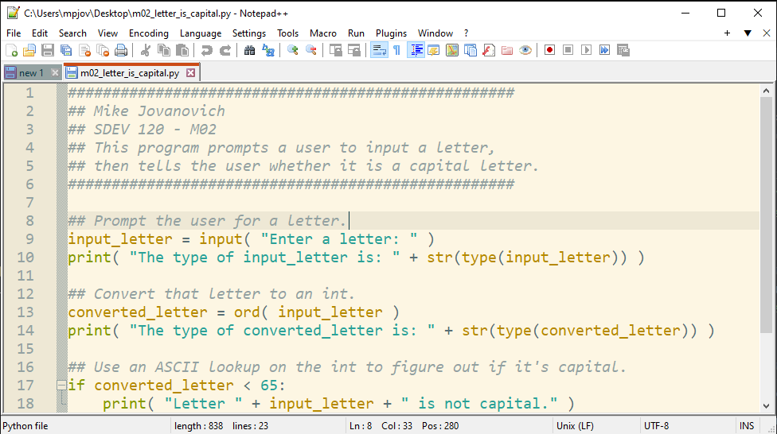
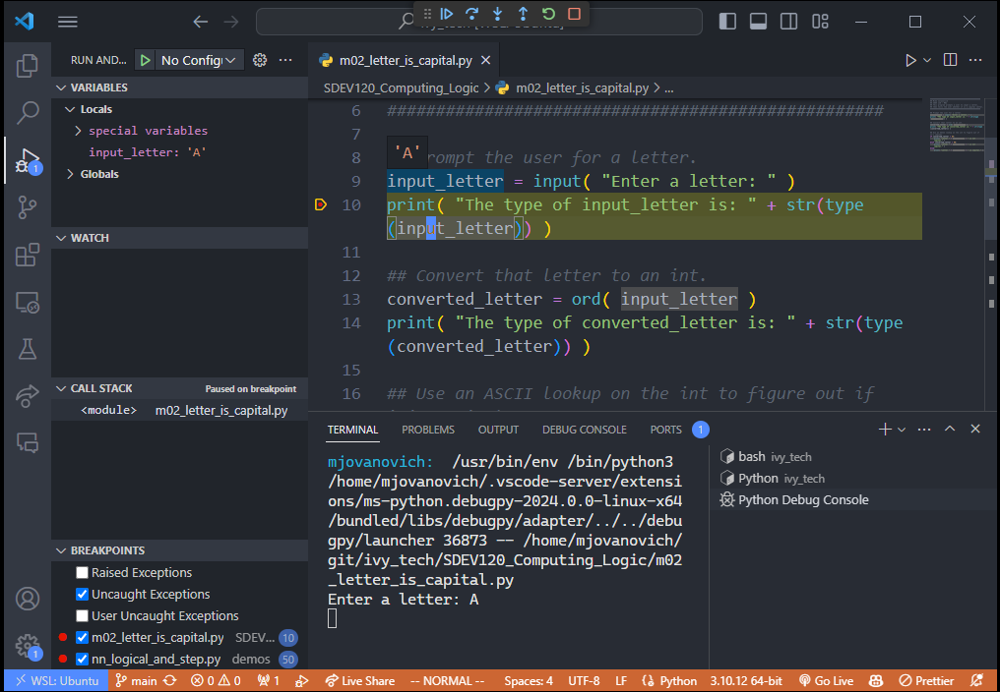

- [Coding Environments](#coding-environments)
  - [Text Editors](#text-editors)
  - [Integrated Development Environments (IDEs)](#integrated-development-environments-ides)
    - [Features](#features)
      - [Syntax Highlighting](#syntax-highlighting)
      - [Auto-Formatting](#auto-formatting)
      - [Code Completion](#code-completion)
      - [Debugging](#debugging)
      - [Version Control Integration](#version-control-integration)
- [Debugging Techniques and Coding Tips](#debugging-techniques-and-coding-tips)
  - [Commenting Code](#commenting-code)
  - [Using Output / Print Statements](#using-output--print-statements)
  - [Using a Debugger](#using-a-debugger)

# Coding Environments

<figure>
    <span>
        
    </span>
</figure>

## Text Editors

<figure>
    <span>
        
    </span>
</figure>

A **text editor** is a type of program used for editing plain text files.

Good for simple programs when debugging is not necessary.

May or may not offer syntax highlighting.

_Examples:_

- **Notepad**
- **Notepad++**
- **TextEdit**
- **nano**
- **vi** / **vim**
- **emacs**
- **gedit**
- **Sublime Text**
- **Atom**

## Integrated Development Environments (IDEs)

<figure>
    <span>
        
    </span>
    <figcaption>
        <a href=""></a>
    </figcaption>
</figure>

An **integrated development environment (IDE)** is a software application used to develop software.

More complex than a text editor.

_Examples:_

- **VS Code**
- **Visual Studio**
- **Eclipse**
- **NetBeans**
- **IntelliJ IDEA**
- **PyCharm**
- **Xcode**
- **Android Studio**

### Features

The following features are common in IDEs. Some text editors may also offer these features.

#### Syntax Highlighting

**Syntax highlighting** displays code in different colors and fonts according to the category of terms.

Makes the code much easier to read.

#### Auto-Formatting

**Auto-formatting** automatically indents and formats code.

#### Code Completion

**Code completion** automatically suggests code as you type.

#### Debugging

<figure>
    <span>
        
    </span>
    <figcaption>
        The first computer bug, a moth, was found inside a Harvard Mark II computer in 1947.
    </figcaption>
</figure>

**Debugging** is the process of finding and resolving defects or problems within the program.

A **debugger** is a computer program that is used to test and debug other programs. IDEs usually include a debugger.

- Step through code
- Set breakpoints
- Inspect variables
- Watch expressions

#### Version Control Integration

**Version control** is a system that records changes to a file or set of files over time so that you can recall specific versions later.

**Git** is a popular version control system.

# Debugging Techniques and Coding Tips

## Commenting Code

**Comments** should be used to explain the code and make it easier to understand.

The first line below will not be treated as executable code:

```python
# Add 5 to x
x = x + 5
```

Can also be used to temporarily disable code:

```python
x = 7
y = '5'
# Not sure why this line isn't working... better comment it for now.
# z = x + y
```

## Using Output / Print Statements

Simple but effective way to see what your code is doing.

```python
x = 5
y = some_function_dont_know_what_it_does(x)

# Temporary debug output, remove when done:
print(y)
```

## Using a Debugger

- **Breakpoints** are points in your code where you want to pause and inspect the program.
- Step through your code line by line after setting a breakpoint.
  - "Step over" to execute the current line and move to the next line.
  - "Step into" to move into a function call.
  - We will cover this more as we do more coding...
