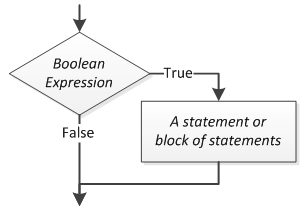
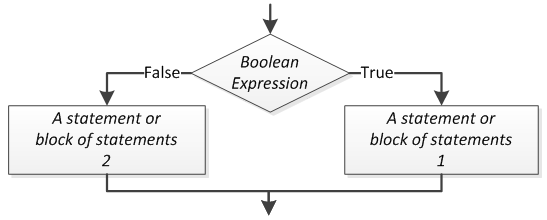
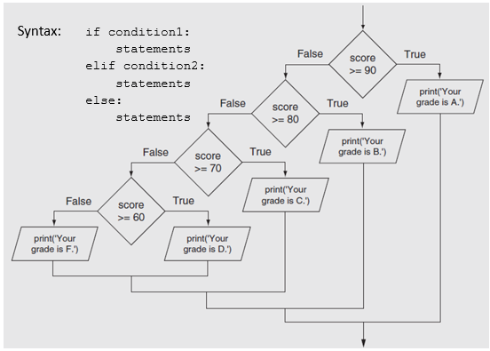

- [Decision](#decision)
  - [Single Alternative](#single-alternative)
    - [Example Algorithm](#example-algorithm)
      - [Pseudocode](#pseudocode)
      - [Flowchart](#flowchart)
    - [Python `if` Statement](#python-if-statement)
      - [Demo Programs](#demo-programs)
  - [Dual Alternative](#dual-alternative)
    - [Example Algorithm](#example-algorithm-1)
      - [Pseudocode](#pseudocode-1)
      - [Flowchart](#flowchart-1)
    - [Python `if, else` Statement](#python-if-else-statement)
      - [Demo Programs](#demo-programs-1)
  - [Fallthrough Decisions](#fallthrough-decisions)
    - [Example Algorithm](#example-algorithm-2)
      - [Pseudocode](#pseudocode-2)
      - [Flowchart](#flowchart-2)
    - [Python `if, elif, else` Statement](#python-if-elif-else-statement)
      - [Demo Programs](#demo-programs-2)
  - [Nested Decision Structures](#nested-decision-structures)
    - [Pseudocode](#pseudocode-3)
    - [Flowchart](#flowchart-3)

# Decision

**Selection** is the process of taking an action based on a condition.

This decision must resolve to a **boolean** value, which is either `true` or `false`.

In other words, it must use an **boolean expression** to make the decision.

## Single Alternative

A **single alternative decision structure** yields control to a process only if some boolean expression is true.



### Example Algorithm

Charge Customer for Item - v1

#### Pseudocode

```plaintext
BEGIN
    Begin point of sales transaction
    Scan all items

    IF customer is a rewards member:
        Apply discount
    END IF

    Complete point of sales transaction
END
```

#### Flowchart

...

### Python `if` Statement

Anything inside the code block (indented at the if’s level) will be evaluated only if the “if” expression evaluates to true.

The expression for the if statement can be arbitrarily complex - the only constraint is that it must evaluate to True or False.

```python
if x:
    # do something
```

Examples:

```python
if x:
if x == True:
if has_account == False:
if a > b:
if is_admin and current_page == 'User Management':
if is_admin == False or user_logged_in == False:
```

#### Demo Programs

... rename and link ...

Number is even (single dec. st.)

## Dual Alternative

A **dual alternative decision structure** yields control to one of two processes based on the truthfulness of a given boolean condition.



Dual alternative example: Open communication channel with landing aircraft.

- “Runway is clear?”
  - True - Direct aircraft to land.
  - False - Send aircraft to hold pattern.

### Example Algorithm

Charge Customer for Item - v2

#### Pseudocode

```plaintext
BEGIN
    Begin point of sales transaction
    Scan all items

    IF customer is a rewards member:
        Apply discount

    Get payment method

    IF payment method is credit card:
        Swipe card
    ELSE
        Take cash
    END IF

    End point of sales transaction
END
```

#### Flowchart

...

### Python `if, else` Statement

```python
if x:
    # do something
else:
    # do something else
```

#### Demo Programs

... flowchart ...

... rename and link ...

Number is even/odd (dual dec. st.)

## Fallthrough Decisions

We can chain together arbitrary amounts of decisions to represent “fallback logic” - if, else if, else if, … else.

We do not always need a final “else”.



What happens if we don't use else if here?

### Example Algorithm

Charge Customer for Item - v3

#### Pseudocode

```plaintext
BEGIN
    Begin point of sales transaction
    Scan all items

    IF customer is a rewards member:
        Apply discount

    Get payment method

    IF payment method is credit card:
        Swipe card
    ELSE IF payment method is cash:
        Take cash
    ELSE
        Deny payment
        Shelve items for restocking
    END IF

    End point of sales transaction
END
```

#### Flowchart

...

### Python `if, elif, else` Statement

```python
if x:
    # do something
elif y:
    # do something else
else:
    # do something else
```

#### Demo Programs

[Percent to Grade Program](https://github.com/mpjovanovich/ivy_tech/blob/main/SDEV120_Computing_Logic/grade_calc_if_elif_else.py)

## Nested Decision Structures

_Example Algorithm: Charge Customer for Item_

### Pseudocode

```plaintext
BEGIN
    Begin point of sales transaction
    Scan all items

    IF customer is a rewards member:
        Apply discount

    Get payment method

    IF payment method is credit card:
        Swipe card
    ELSE IF payment method is cash:
        Take cash
        If cash is greater than total:
            Give change
    END IF

    End point of sales transaction
END
```

### Flowchart

...

...

We can put decision structures into the flow of execution from another decision. These are called nested decisions.

_Note:_ We don’t want to duplicate decision logic if possible. Often times we can extract a decision that would otherwise be nested.

<p class="demo">Demo:</p>

Program: What to wear based on temperature.

- possible outcomes:
  - snowing, not snowing - temp <= 32
  - raining, not raining - temp > 32
  - cold, coat - temp < 45
  - mild, jacket - temp < 70
- e.g. outcome statements
  - It is rainy and warm. You need a jacket and umbrella.
  - It is clear and mild. You need a jacket.
  - It is snowy and cold. You need a coat.
- Which variables are inputs?
  - temperature
  - precipitation

<p class="demo">Demo:</p>

Write program to figure out if letter is capital

- Hint: look at ASCII / Unicode - https://www.ascii-code.com/
- Hint: Python uses ord() and int() functions
- m02_letter_is_capital_v1.py
