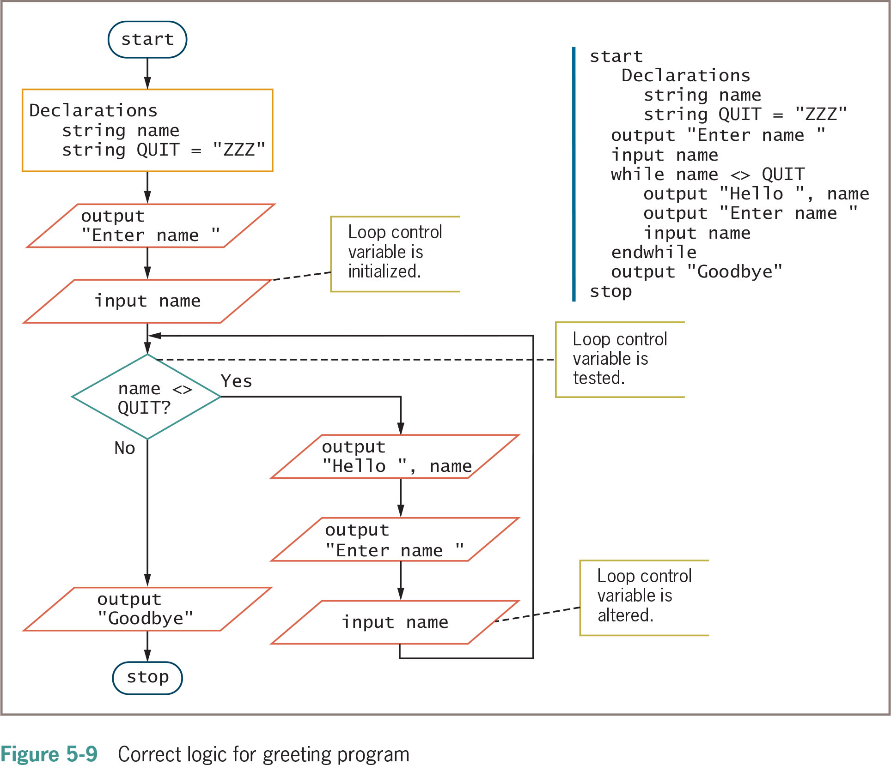

<figure>
    
        
    
</figure>

- [Flowcharts](#flowcharts)
  - [Flowchart Symbols](#flowchart-symbols)
    - [Terminator](#terminator)
    - [Flow Arrow](#flow-arrow)
    - [Process](#process)
    - [Decision](#decision)
    - [Input / Output](#input--output)
    - [Data Store](#data-store)
    - [Process](#process-1)

# Flowcharts

A flowchart is a visual representation of a process.

Flowchart symbols are standardized, but verbage and symbols are not.

## Flowchart Symbols

### Terminator

<figure>
    
        
    
</figure>

- Oval or rounded rectangle.
- Indicates the start or end of a process.

### Flow Arrow

<figure>
    
        
    
</figure>

- Arrow connecting two symbols.
- Indicates the flow of the process.

### Process

<figure>
    
        
    
</figure>

- Rectangle.
- Represents a process, action, or operation.
- Typically contains a verb.
- Examples:
  - "Calculate total"
  - "Print invoice"
  - "Add new customer"

### Decision

<figure>
    
        
    
</figure>

- Represents a decision point.
- Branches to different parts of the flowchart based on a condition.
- Branches are labeled
  - "Yes" or "No"
  - "True" or "False"
- Examples:
  - "Is the customer a member?"
  - "Customer is member?"
  - "Is the balance over $1000?"
  - "Balance > $1000?"

### Input / Output

<figure>
    
        
    
</figure>

- Represents input or output.
- May have arrow pointing to or from the symbol.
  - Arrow connecting on the left side is input.
  - Arrow stemming from the right side is output.
- Input can be a variable assignment.

_Input Example:_

- "input customer name"
- "enter customer name"
- "-> customer name"
- "customer name"

_Output Example:_

- "print total"
- "display total"
- "output total"

### Data Store

<figure>
    
        
    
</figure>

- Cylinder
- Represents a data store
  - Database
  - File

### Process

<figure>
    
        
    
</figure>

- Rectangle
- Represents a "sub-process" that is defined elsewhere
- Examples:
  - "Calculate total"
  - "Print invoice"
  - "Add new customer"
