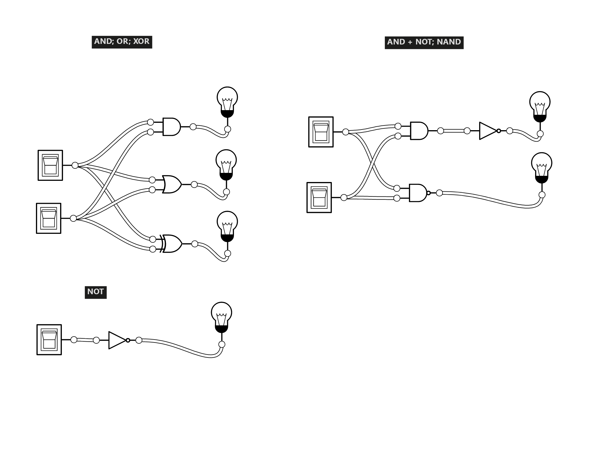
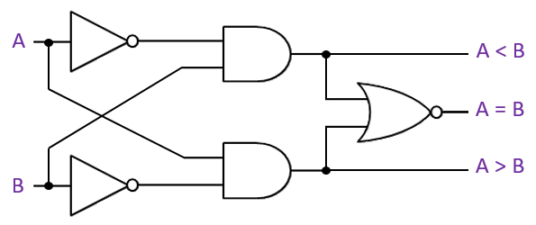

- [Logic Gates](#logic-gates)
  - [Foundations](#foundations)
  - [Basic Gates](#basic-gates)
  - [Operations with Gates](#operations-with-gates)

# Logic Gates

For an excellent logic gate sandbox, see: [Logic.ly](https://logic.ly/demo).

## Foundations

- Computers recognize only two states, based on the presence or absence of an electrical signal.
  - High voltage = 1 = true
  - Low voltage = 0 = false
- A **logic gate** is a device that performs a logical operation on one or more binary inputs and produces a single binary output.
- A **circut** is a collection of logic gates that work together to perform a specific task.

## Basic Gates

The logical connectives that we've learned so far have corresponding logic gates.

The truth table for each gate matches the truth table for the corresponding logical connective.

Demo:

Logic.ly

<figure>
    
        
    
    <figcaption>
        
    </figcaption>
</figure>

## Operations with Gates

Demo:

One bit magnitude comparator

<figure>
    
        
    
    <figcaption>
        
    </figcaption>
</figure>

Using A = 1, B = 1 as an example, let’s figure out the inputs to the gates that lead to each outcome:

**What is the logic circuit for A < B?**

- ¬A ∧ B
- 0 ∧ 1 = False

**What is the logic circuit for A > B?**

- A ∧ ¬B
- 1 ∧ 0 = False

**What is the logic circuit for A = B?**

- ¬( (¬A ∧ B) ∨ (A ∧ ¬B) )
- A ∨ ¬B ∧ ¬A ∨ B
- A ∨ (¬B ∧ ¬A) ∨ B
- 1 ∨ (0 ∧ 0) ∨ 1
- 1 ∨ 0 ∨ 1 = True
