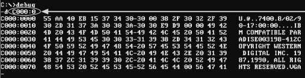
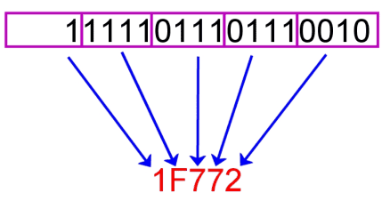

- [Numbering Systems](#numbering-systems)
  - [Everyday Numbering Systems](#everyday-numbering-systems)
    - [Base 10](#base-10)
    - [Base 12 and 24](#base-12-and-24)
    - [Base 60](#base-60)
  - [Computing Numbering Systems](#computing-numbering-systems)
    - [Binary](#binary)
      - [Why is it Used?](#why-is-it-used)
      - [Examples](#examples)
        - [Digital Signals](#digital-signals)
        - [Computation](#computation)
      - [Metric System for Binary](#metric-system-for-binary)
    - [Hexadecimal](#hexadecimal)
      - [Why is it Used?](#why-is-it-used-1)
      - [Examples](#examples-1)
        - [Memory Addresses](#memory-addresses)
        - [Colors](#colors)
  - [Converting Between Bases](#converting-between-bases)
    - [Positional Notation](#positional-notation)
      - [Binary / Hex to Decimal](#binary--hex-to-decimal)
        - [Example 1](#example-1)
        - [Example 2](#example-2)
      - [Example 3](#example-3)
      - [Example 4](#example-4)
      - [Example 5](#example-5)
      - [Decimal to Binary / Hex](#decimal-to-binary--hex)
        - [Long Division Refresher](#long-division-refresher)
        - [Example 1](#example-1-1)
        - [Example 2](#example-2-1)
        - [Example 3](#example-3-1)
      - [Binary to Hex (and Reverse)](#binary-to-hex-and-reverse)
        - [Example 1](#example-1-2)
        - [Example 2](#example-2-2)
  - [Binary Arithmetic and Encodings](#binary-arithmetic-and-encodings)
    - [Binary Addition](#binary-addition)
        - [Example 1](#example-1-3)
    - [Complement Encoding](#complement-encoding)
      - [Why Use It?](#why-use-it)
      - [One's Complement Encoding](#ones-complement-encoding)
        - [Example 1](#example-1-4)
        - [Example 2](#example-2-3)
        - [Example 3](#example-3-2)
      - [Two's Complement Encoding](#twos-complement-encoding)
        - [Example 1](#example-1-5)
        - [Example 2](#example-2-4)
        - [Example 3](#example-3-3)

# Numbering Systems

We can use any number of symbols to represent the same numeric value.

Example: write the number “ten” in base 1 through 10

| Base | Symbols                                            | Representation 10<sub>(10)</sub> |
| :--- | :------------------------------------------------- | -------------------------------: |
| 1    | { 1 }                                              |                       1111111111 |
| 2    | { 0, 1 }                                           |                             1010 |
| 3    | { 0, 1, 2 }                                        |                              101 |
| 4    | { 0, 1, 2, 3 }                                     |                               22 |
| 5    | { 0, 1, 2, 3, 4 }                                  |                               20 |
| 6    | { 0, 1, 2, 3, 4, 5 }                               |                               14 |
| 7    | { 0, 1, 2, 3, 4, 5, 6 }                            |                               13 |
| 8    | { 0, 1, 2, 3, 4, 5, 6, 7 }                         |                               12 |
| 9    | { 0, 1, 2, 3, 4, 5, 6, 7, 8 }                      |                               11 |
| 10   | { 0, 1, 2, 3, 4, 5, 6, 7, 8, 9 }                   |                               10 |
| ...  | ...                                                |                              ... |
| 16   | { 0, 1, 2, 3, 4, 5, 6, 7, 8, 9, A, B, C, D, E, F } |                                A |

## Everyday Numbering Systems

### Base 10

- Our "counting" numbering system.
- Probably evolved from counting on fingers.

### Base 12 and 24

- Used for time
  - 12 hours in half day
  - 24 hours in day
- Theory of why?
  - Twelve bones on non-thumb fingers that can be counted with the thumb.

### Base 60

- Used for time
  - 60 seconds in minute
  - 60 minutes in hour

## Computing Numbering Systems

### Binary

**_Base 2_**

{ 0, 1 }

#### Why is it Used?

- Digital signal can be in one of two states:
  - **_Off = 0_**
  - **_On = 1_**

#### Examples

##### Digital Signals

<figure>
    <span>
        
    </span>
    <figcaption>
        <a href="https://www.electronicshub.org/analog-circuits-and-digital-circuits/">
            Analog vs Digital Signal - Top is electrical signal, bottom is digital signal.
        </a>
    </figcaption>
</figure>

- Measuring electrical signal as it comes into circuit.
- Use a threshold function to determine if a signal is on or off.

##### Computation

All of modern computing can be represented in binary.

- Command codes
- Data
- Memory addresses
- ...

#### Metric System for Binary

| Term      | Abbreviation |     Conversion |    Size (Magnitude) | Example Usage         |
| :-------- | :----------- | -------------: | ------------------: | :-------------------- |
| bit       | b            |              1 |                   1 | Register in CPU       |
| byte      | B            |      1 B = 8 b |              8 bits | A character           |
| kilobyte  | KB           |  1 KB = 1024 B |       tousand bytes | A text file.          |
| megabyte  | MB           | 1 MB = 1024 KB |       million bytes | A photo file.         |
| gigabyte  | GB           | 1 GB = 1024 MB |       billion bytes | A video file.         |
| terabyte  | TB           | 1 TB = 1024 GB |      trillion bytes | Hard drive capacity.  |
| petabyte  | PB           | 1 PB = 1024 TB |   quadrillion bytes | Data center capacity. |
| exabyte   | EB           | 1 EB = 1024 PB | quintilillion bytes | Supercomputer FLOPS   |
| zettabyte | ZB           | 1 ZB = 1024 EB |    sextillion bytes | ...                   |
| yottabyte | YB           | 1 YB = 1024 ZB |    septillion bytes | ...                   |

- We don't typically go down to the bit level when measuring; smallest you'll see is bytes

- Mb = megabit
  - Not to be confused with MB = megabyte
  - Used in telecommunications to measure bandwidth (e.g. Internet speeds).
  - 1 Mb = 1,000,000 bytes
  - 1 MB = 1,048,576 bytes

<details>
    <summary>Given a file that is 564,707,328 bytes, find its size in MB.</summary>
    <div>
        <p>Cancel units until we get to where we need to be...</p>
        <p>564,707,328 bytes * (1 KB / 1024 byte) = 551,472 KB</p>
        <p>551,472 KB * (1 MB / 1024 KB) = 538.55 MB</p>
        <p>Answer: 538.55 MB</p>
    </div>
</details>

Can we go the other way?

- Find a file on disk on MB scale and figure out how many bytes.
- Check result with Windows Explorer "properties".
- (May not be exact match due to file system overhead.)

### Hexadecimal

**_Base 16_**

{ 0, 1, 2, 3, 4, 5, 6, 7, 8, 9, A, B, C, D, E, F }

- Often prefixed with “0x”, e.g:
  - 0x4F

#### Why is it Used?

- Binary numbers get really long. Hex is more compact.
- Easier to convert binary to hex than to decimal.

#### Examples

##### Memory Addresses

e.g., in a memory dump after a program crash

<figure>
    <span>
        
    </span>
    <figcaption>
        Memory Addresses in Hex
    </figcaption>
</figure>

##### Colors

- Represented as RGB (red, green, blue) values.
- Usually has a pound sign when used for color.
- Values are from 0-255 for each component
  - #<span style="color: red">FF</span>0000 = red
  - #00<span style="color: green">FF</span>00 = green
  - #0000<span style="color: blue">FF</span> = blue
  - #<span style="color: #FF00FF">FF</span>00<span style="color: #FF00FF">FF</span> = magenta(?)

<p class="demo">Demo:</p>

- Let's change the bg color on Google's search page...

<p class="demo">Demo:</p>

```bash
## Each 2 hex digits is a byte.
## In a text file, each byte is a character.
xxd some_file.txt | head

## Now let's check the binary... pretty long
xxd -b some_file.txt | head
```

<br>
<br>

## Converting Between Bases

<!-- Ref: https://docs.google.com/document/d/1WJj9YJb5upftC4Tf81llDjUpONqWI0RlHOmui1N-mYg/edit -->

### Positional Notation

Given some number (number)<sub>base</sub>

- Each digit in the number has a position.
- Value of position is base raised to the power of the position.
- Then multiply by the value of the digit.

#### Binary / Hex to Decimal

##### Example 1

Evaluate the component parts of the number (1049)<sub>10</sub>

| Position / Place | 10<sup>3</sup> | 10<sup>2</sup> | 10<sup>1</sup> | 10<sup>0</sup> |
| :--------------: | :------------: | :------------: | :------------: | :------------: |
|  Position Value  |      1000      |      100       |       10       |       1        |
|      Digit       |       1        |       0        |       4        |       9        |
|     Product      |      1000      |       0        |       40       |       9        |

Answer: 1000 + 0 + 40 + 9 = **(_1049_)<sub>10</sub>**

##### Example 2

Convert the binary number to decimal: (1001)<sub>2</sub>

| Position / Place | 2<sup>3</sup> | 2<sup>2</sup> | 2<sup>1</sup> | 2<sup>0</sup> |
| :--------------: | :-----------: | :-----------: | :-----------: | :-----------: |
|  Position Value  |       8       |       4       |       2       |       1       |
|      Digit       |       1       |       0       |       0       |       1       |
|     Product      |       8       |       0       |       0       |       1       |

Answer: 8 + 0 + 0 + 1 = **_9<sub>10</sub>_**

#### Example 3

Convert the binary number to decimal: (11111)<sub>2</sub>

... walkthrough ...

#### Example 4

Convert the hex number to decimal: 0x00B2

| Position / Place | 16<sup>3</sup> | 16<sup>2</sup> | 16<sup>1</sup> | 16<sup>0</sup> |
| :--------------: | :------------: | :------------: | :------------: | :------------: |
|  Position Value  |      4096      |      256       |       16       |       1        |
|      Digit       |       0        |       0        |     B (11)     |       2        |
|     Product      |       0        |       0        |      176       |       2        |

Answer: 0 + 0 + 176 + 2 = **_(178)<sub>10</sub>_**

#### Example 5

<p class="demo">Walkthrough:</p>

Convert the hex number to decimal: 0x01FF

#### Decimal to Binary / Hex

To convert from decimal to a destination base:

While quotient (result of division) is not zero:

- Divide the decimal number by the destination base.
- The remainder is the digit in the destination base.
- Set the divided number to quotient.

##### Long Division Refresher

<figure>
    <span>
        
    </span>
    <figcaption>
        <a href="https://www.inchcalculator.com/long-division-calculator/">Division Terminology</a>
    </figcaption>
</figure>

<p class="demo">Walkthrough:</p>

117 / 5

##### Example 1

Convert the decimal number to binary: (12)<sub>10</sub>

| Division | Quotient | Remainder | Binary Digit |
| :------: | :------: | :-------: | :----------: |
|  12 / 2  |    6     |     0     |      0       |
|  6 / 2   |    3     |     0     |      0       |
|  3 / 2   |    1     |     1     |      1       |
|  1 / 2   |    0     |     1     |      1       |

Answer: **_(1100)<sub>2</sub>_**

##### Example 2

Convert the decimal number to binary: (21)<sub>10</sub>

| Division | Quotient | Remainder | Binary Digit |
| :------: | :------: | :-------: | :----------: |
|  21 / 2  |    10    |     1     |      1       |
|  10 / 2  |    5     |     0     |      0       |
|  5 / 2   |    2     |     1     |      1       |
|  2 / 2   |    1     |     0     |      0       |
|  1 / 2   |    0     |     1     |      1       |

Answer: **_(10101)<sub>2</sub>_**

##### Example 3

Convert the decimal number to hex: (37)<sub>10</sub>

| Division | Quotient | Remainder | Hex Digit |
| :------: | :------: | :-------: | :-------: |
|  37/16   |    2     |     5     |     5     |
|   2/16   |    0     |     2     |     2     |

Answer: (25)<sub>16</sub> = **0x25**

#### Binary to Hex (and Reverse)

Hex offers a nice, compact way to represent binary numbers.

- Break binary number into groups of 4 bits (called a **nibble**).
  - Each nibble is guaranteed to be a number from 0-15; 0-F in hex.
- Convert each nibble to hex.
- Concatenate the results - put them back together.

<figure>
    <span>
        
    </span>
    <figcaption>
        Binary to Hex
    </figcaption>
</figure>

<p class="demo">Demo:</p>

Which hex digits can we represent with four bits?

- [logic.ly](https://logic.ly/demo/)

<figure>
    <span>
        
    </span>
    <figcaption>
        Four bits to hex.
    </figcaption>
</figure>

##### Example 1

<details>
    <summary>Convert binary to hex: (10100010)<sub>2</sub></summary>
    <div>
        <ul>
            <li><span style="font-weight:bold;color: lightblue;">(1010)<sub>2</sub></span> <span style="font-weight:bold;color: orange;">(0010)<sub>2</sub></span></li>
            <li><span style="font-weight:bold;color: lightblue;">(10)<sub>10</sub></span> <span style="font-weight:bold;color: orange;">(2)<sub>10</sub></span></li>
            <li><span style="font-weight:bold;color: lightblue;">(A)<sub>16</sub></span> <span style="font-weight:bold;color: orange;">(2)<sub>16</sub></span></li>
            <li><span style="font-weight:bold;">0xA2</span></li>
        </ul>
    </div>
</details>

##### Example 2

<details>
    <summary>Convert hex to binary: 0xF0FF</summary>
    <div>
        <ul>
            <li>
                <span style="font-weight:bold;color:lightblue;">(F)<sub>16</sub></span>&nbsp; 
                <span style="font-weight:bold;color:orange;">(0)<sub>16</sub></span>&nbsp;
                (F)<sub>16</sub>&nbsp;
                (F)<sub>16</sub>
            </li>
            <li>
                <span style="font-weight:bold;color:lightblue;">(15)<sub>10</sub></span>&nbsp; 
                <span style="font-weight:bold;color:orange;">(0)<sub>10</sub></span>&nbsp;
                (15)<sub>10</sub>&nbsp;
                (15)<sub>10</sub>
            </li>
            <li>
                <span style="font-weight:bold;color:lightblue;">(1111)<sub>2</sub></span>&nbsp; 
                <span style="font-weight:bold;color:orange;">(0000)<sub>2</sub></span>&nbsp;
                (1111)<sub>2</sub>&nbsp;
                (1111)<sub>2</sub>
            </li>
            <li><span style="font-weight:bold;">1111000011111111</span></li>
        </ul>
    </div>
</details>

## Binary Arithmetic and Encodings

### Binary Addition

Same as decimal addition except - When carrying numbers into the next column we represent them in binary form.

When adding a column you can either have (depending on remainder and row values):

- zero = 0
- one = 1
- two = 10
- three = 11

##### Example 1

Calculate 0111<sub>2</sub> + 1110<sub>2</sub>.

|     1 |     1 |     1 |       |       |
| ----: | ----: | ----: | ----: | ----: |
|       |     0 |     1 |     1 |     1 |
|     + |     1 |     1 |     1 |     0 |
| **1** | **0** | **1** | **0** | **1** |

- Does this tie out if we calc in decimal?...

<!-- ### Bitwise Operations -->

<!-- #### Bitmasking -->

<!-- #### Bitshifting -->

### Complement Encoding

<figure>
    <span>
        
    </span>
    <figcaption>
        <a href="https://www.electronics-tutorials.ws/binary/signed-binary-numbers.html">Positive Signed Binary Number</a>
    </figcaption>
</figure>

<figure>
    <span>
        
    </span>
    <figcaption>
        <a href="https://www.electronics-tutorials.ws/binary/signed-binary-numbers.html">Negative Signed Binary Number</a>
    </figcaption>
</figure>

**_Complement_** = negation

**_Most significant bit (MSB)_** = digit with the greatest value.

**_Big-endian_** = MSB on left

**_Little-endian_** = MSB on right

#### Why Use It?

- Easy to implement in hardware.
  - Binary adder
- Easy to add and subtract.

#### One's Complement Encoding

- Used in early computers.
- Positive numbers do not change.
- Negative numbers are represented by flipping all bits.
- Make sure to represent in correct number of bits (4, 8, 16, 32, 64, etc.)

Subtraction:

- Take one's complement of second number.
- Add two numbers.
- Discard any carry over from MSB.
- Add 1 to result.

##### Example 1

Find the one's complement of 01001110.

- Answer: 10110001

##### Example 2

Find 7<sub>10</sub> - 4<sub>10</sub> using one’s complement subtraction.

- 7<sub>10</sub> = 0111<sub>2</sub>
- 4<sub>10</sub> = 0100<sub>2</sub>
- One’s complement of 4<sub>10</sub> = -4<sub>10</sub> = 1011<sub>2</sub>
- 0111<sub>2</sub> + 1011<sub>2</sub> = 1 0010<sub>2</sub>
- Ignore overflow bit: ~~1~~ 0010<sub>2</sub>
- Add one: 0010<sub>2</sub> + 1 = 0011<sub>2</sub>

##### Example 3

<p class="demo">Walkthrough:</p>

Find 1111<sub>2</sub> - 0110<sub>2</sub> using one’s complement subtraction.

#### Two's Complement Encoding

- Used in modern computers.
- Positive numbers do not change.
- Negative numbers are represented by flipping all bits and adding 1.
- Make sure to represent in correct number of bits (4, 8, 16, 32, 64, etc.)

Subtraction:

- Take two's complement of second number.
- Add two numbers.
- _Don’t need the extra step at the end to add one._
  - If there is carry over from MSB, discard it. Result is positive.
  - If there is no carry over from MSB, take two's complement of result. Result is negative.

##### Example 1

Find the two's complement of 01001110.

- One's complement: 10110001
- Add 1: 10110001 + 1 = 10110010
- Answer: 10110010

##### Example 2

Find 7<sub>10</sub> - 4<sub>10</sub> using two’s complement subtraction.

- 7<sub>10</sub> = 0111<sub>2</sub>
- 4<sub>10</sub> = 0100<sub>2</sub>
- Two’s complement of 4<sub>10</sub> = -4<sub>10</sub> + 1 = 1011<sub>2</sub> + 1 = 1100<sub>2</sub>
- 0111<sub>2</sub> + 1100<sub>2</sub> = 1 0011<sub>2</sub>
- Ignore overflow bit: ~~1~~ 0011<sub>2</sub>

##### Example 3

Find 4<sub>10</sub> - 7<sub>10</sub> using two’s complement subtraction.

- 4<sub>10</sub> = 0100<sub>2</sub>
- 7<sub>10</sub> = 0111<sub>2</sub>
- Two’s complement of 7<sub>10</sub> = -7<sub>10</sub> + 1 = 1000<sub>2</sub> + 1 = 1001<sub>2</sub>
- 0100<sub>2</sub> + 1001<sub>2</sub> = 1101<sub>2</sub>
- No overflow bit, so result is negative. We need to take the two's complement of the result.
  - Two's complement of 1101<sub>2</sub> = 0010<sub>2</sub> + 1 = 0011<sub>2</sub>
