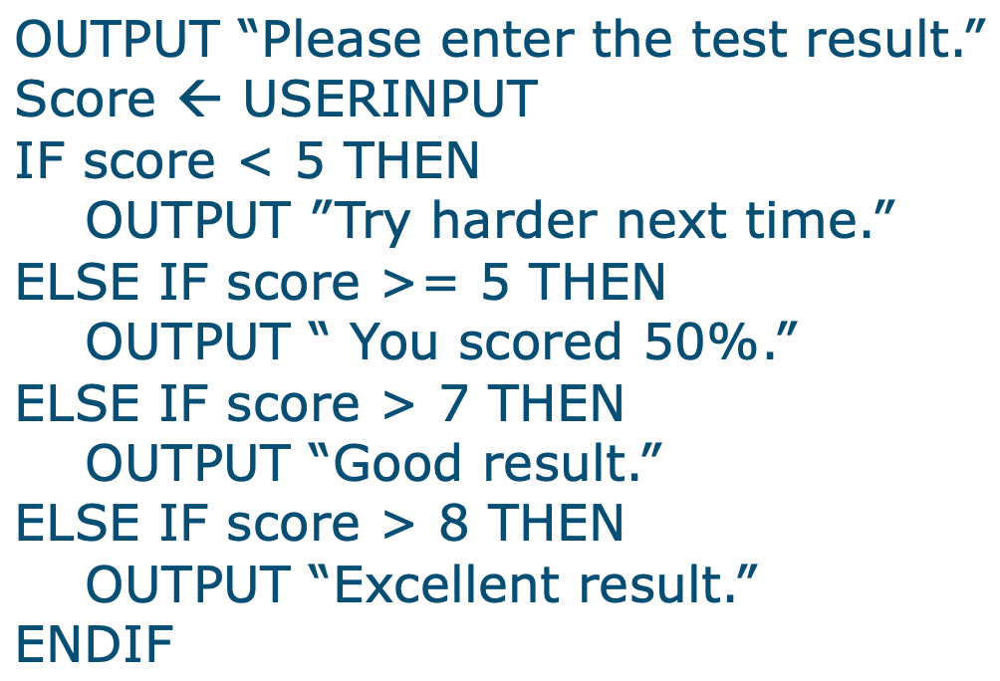

<figure>
    <span>
        
    </span>
</figure>

- [PseudoCode](#pseudocode)
  - [What is PseudoCode?](#what-is-pseudocode)
  - [Why use PseudoCode?](#why-use-pseudocode)
  - [How do I write PseudoCode?](#how-do-i-write-pseudocode)
  - [Examples](#examples)
  - [Different ways to get the same result?](#different-ways-to-get-the-same-result)

# PseudoCode

## What is PseudoCode?

_... and why are there so many?_

<figure>
    <span>
        
    </span>
</figure>

<figure>
    <span>
        
    </span>
</figure>

<figure>
    <span>
        
    </span>
</figure>

- Pseudocode is a way to write out the steps of an algorithm in a way that is understandable to humans.
- Pseudo = fake
- Code = code
- It is not code (not a programming language)

## Why use PseudoCode?

- Prep for coding
  - Think through the steps
  - Identify potential problems
  - Present to other devs
- Demonstrate algorithm to non-devs
  - Clients
  - Managers
  - Other stakeholders

## How do I write PseudoCode?

- There is no formal way.
- _\*Your textbook claims there is - this is incorrect._

**Generally:**

- Use a combination of English and code-like syntax.
- Start with "Start" or "Begin"
- End with "End"
- Indent the body of the algorithm
- Use indentation to show hierarchy for nested statements
- Use capitalization and / or boldface for keywords
- Use a consistent style
- Use comments (outside of the algorith) to explain if more context is needed

## Examples

_See how day will be_

```
START
    Wake up
    Get out of bed
    IF you are on the right side of the bed
        Have a good day
    ELSE
        Have a bad day
    END IF
END
```

_Eat whole bag of cookies_

```
START
    Open bag of cookies
    WHILE there are cookies in the bag
        Eat cookie
    END WHILE
    Be sick and regret
END
```

## Different ways to get the same result?

Let's brainstorm:

_Travel from Indianapolis to Las Angeles (by plane)_

...

_Print even integers between 0 and 10_

...
