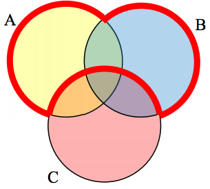

- [Set Theory](#set-theory)
  - [Definitions](#definitions)
  - [Notation](#notation)
  - [Subsets and Supersets](#subsets-and-supersets)
  - [Proper Subsets](#proper-subsets)
  - [Venn Diagrams](#venn-diagrams)
    - [Intersection](#intersection)
    - [Union](#union)
    - [Complement](#complement)
  - [Quizzes and Walkthroughs](#quizzes-and-walkthroughs)

> Russell's paradox: consider "the set of all sets that are not members of themselves", which leads to a contradiction since it must be a member of itself and not a member of itself.

# Set Theory

## Definitions

- A **set** is a collection of distinct, unordered **elements**.
  - `{ a, b, a, c }` is not a set because it contains duplicates.
  - `{ a, b, c }` is the same as `{ c, b, a }` because order doesn't matter.

## Notation

- Sets are usually denoted with capital letters.
  - `A = { a, b, c }`
- A set that contains no elements is called the **empty set** or the **null set**.
  - `{}`

## Subsets and Supersets

- A set A is a **subset** of a set B if every element of A is also an element of B.
  - `A = { a, b, c }`
  - `B = { a, b, c, d, e }`
  - Therefore A is a subset of B.
- A set B is a **superset** of a set A if every element of A is also an element of B.
  - This is the inverse of a subset relationship.

Subset / superset example:

- Dog is subset of...
- Canine is subset of...
- Mammal is subset of...
- Animal

Likewise:

- Animal is superset of...
- Mammal is superset of...
- Canine is superset of...
- Dog

## Proper Subsets

- Oddly enough, equality is considered a subset relationship.
  - `A = { a, b, c }`
  - `B = { a, b, c }`
  - Therefore A is a subset of B.
- A set A is a **proper subset** of a set B if every element of A is also an element of B, but A and B are not equal.
  - `A = { a, b, c }`
  - `B = { a, b, c, d, e }`
  - Therefore A is a proper subset of B.

## Venn Diagrams

Logical relationships between sets can be represented visually using Venn diagrams.

### Intersection

- The **intersection** of two sets is the set of elements that are in both sets.
- Symbol: `∩`
- Logical AND
  - `A = { a, b, c }`
  - `B = { a, b, c, d, e }`
  - `A ∩ B = { a, b, c }`

Demo:

Venn...

### Union

- The **union** of two sets is the set of elements that are in either set.
- Symbol: `∪`
- Logical OR
  - `A = { a, b, c }`
  - `B = { a, b, c, d, e }`
  - `A ∪ B = { a, b, c, d, e }`

Demo:

Venn...

### Complement

- The **complement** of a set is the set of elements that are not in the set within the context of a universal set.
- Symbol: `'`
- Logical NOT
  - Given a universal set `U = { a, b, c, d, e }`
  - `A = { a, b, c }`
  - `A' = { d, e }`

Demo:

Venn...

## Quizzes and Walkthroughs

Demo:

Translating from Venn to set notation, and vice versa.

_Quiz 1_

    
Solve:
    <ul>
        <li>A = { dog, oak, cherry, red, cow }</li>
        <li>B = { oak, dog, cow, elm, maple, goose }</li>
        <li>C = { door, silk }</li>
        <li>Find: C ∩ A ∪ B</li>
    </ul>
    

    

    <ul>
        <li>{ door, silk } ∩ { dog, oak, cherry, red, cow } ) ∪ { oak, dog, cow, elm, maple, goose }</li>
        <li>{ } ∪ { oak, dog, cow, elm, maple, goose }</li>
        <li>{ oak, dog, cow, elm, maple, goose }</li>
    </ul>
    

Let's Venn this - does it line up?

_Quiz 2_

    
Create an expression that represents the area outlined in red.

    

        
(A ∨ B) ∧ ¬C

        
or with set notation:

        
(A ∪ B) ∩ C'

    

Let's set notation this - does it line up?
