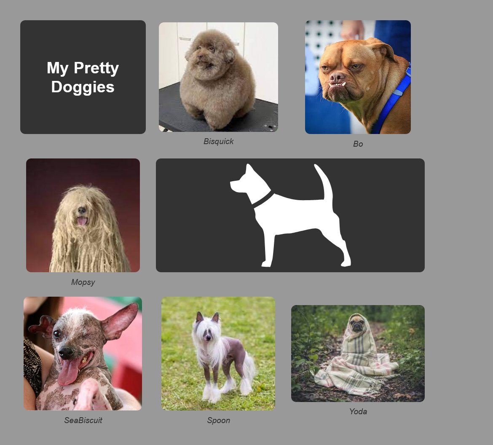

# Lab: Creating a Static Photo Gallery

## Objective

Create a photo gallery using CSS Grid, apply rounded corners to images, style the gallery using the HTML figure element, and use effective image placement.

We will create the following layout:



## Setup

- Create a new folder in your repository root directory called css_static_photo_gallery.
- Create a new HTML file (index.html) and a CSS file (styles.css).
- Give your HTML file the title “My Pretty Doggies”
- Link the CSS file to the HTML file.
- Create a subdirectory called images and place the provided images in the directory with the exception of the svg.

## HTML

### Grid Container

- Inside the body of your HTML file, create a div to serve as the container for your photo gallery grid items.
- Give the div a class name of "photo-gallery".
- The grid will contain the following direct children:
  - h1: "My Pretty Doggies"
  - figure: provided image
  - figure: provided image
  - figure: provided image
  - svg: provided image; _Note: don't use the file path directly we will do this inline at a later step_
  - figure: provided image
  - figure: provided image
  - figure: provided image

### Figure Elements

- In each figure element, include an img element with alt text attribute.
  - We would normally include width and height attributes, but your professor did not do that in his solution so leave those out.
- In each figure element, include a figcaption element with a caption for each image.

### SVG Element

- To create the svg element, open the file with a text editor and copy the contents. You can paste them directly into your HTML file where the svg belongs.

### Classes for Grid Children

- Add a class to the h1 element named "secondary-bg".
- Add a class to the svg element named "secondary-bg".
- Add a class to the svg element named "merged".

## CSS

### Basic Styles

- Begin by applying a CSS reset using the universal selector:

```css
box-sizing: border-box;
margin: 0;
padding: 0;
```

- Give the body element the following styles:

```css
background-color: #999;
font-family: "Roboto", sans-serif;
color: #fff;
padding: 40px;
```

### Grid Layout

- Set the style rules needed to up a basic grid using your photo-gallery class selector:

```css
display: (you provide);
grid-template-columns: (you provide);
grid-template-rows: (you provide);
gap: 20px;
max-width: 800px;
```

- Set the style rule(s) for the "merged" class selector. The svg using this class should span two columns.

### Centering Grid Items

- Use the universal selector to center all items that are immediate children of the grid container. We will accomplish this by making each child element a flex container and centering the content.

```css
width: 100%;
display: flex;
text-align: center;
flex-direction: column;
justify-content: center;
align-items: center;
```

### Coloring and Fonts

- Create a selector to target all figcaption elements that are descendants of the photo-gallery class selector. Set the following style rules:

```css
margin-top: 10px;
font-style: italic;
color: #333;
```

- Use the secondary-bg class to set a background color of #333 for the h1 and svg elements.
- Use the svg-light-fill class to set a fill color of #fff for the svg element. This class is already in place in the HTML.

### Rounded Corners and Max Height

- Create a multi-selector rule for any h1, img, or svg that is a descendent of the photo-gallery class selector. Set the following style rules:

```css
border-radius: 10px;
max-height: 225px;
```

- Reminder: you can create a multi-selector rule by separating selectors with commas.

```css
selector1,
selector2 {
  /* styles here */
}
```
