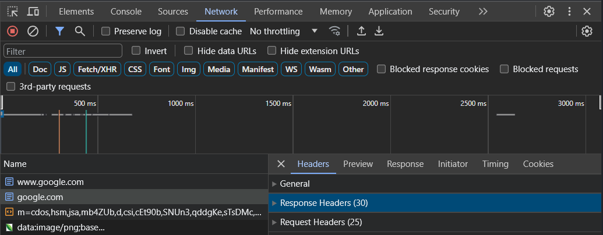

- [HTTP Headers](#http-headers)
  - [Common HTTP Headers for PHP](#common-http-headers-for-php)
  - [Viewing in Developer Tools](#viewing-in-developer-tools)
  - [Setting Headers with PHP](#setting-headers-with-php)
    - [Example](#example)

# HTTP Headers

- Sent by the server to the client with the response.
- Server sets default headers.
- See [HTTP response headers](https://developer.mozilla.org/en-US/docs/Web/HTTP/Headers)

## Common HTTP Headers for PHP

| Header              | Description                                                 |
| ------------------- | ----------------------------------------------------------- |
| Content-Type        | The MIME type of the content.                               |
| Content-Disposition | How the content should be displayed.                        |
| Content-Length      | The length of the content in bytes.                         |
| Location            | The URL to redirect to.                                     |
| Set-Cookie          | Set a cookie.                                               |
| Expires             | The date/time the content expires.                          |
| Cache-Control       | How the content should be cached.                           |
| Pragma              | How the content should be cached (backwards compatibility). |

## Viewing in Developer Tools

- In your browser, open Developer Tools (usually F12 or use the menu).
- Click on the Network tab.
- Click on a request to view the headers.

<figure>
    <span>
        
    </span>
    <figcaption>
        <p>Dev Tools</p>
    </figcaption>
</figure>

## Setting Headers with PHP

- Use the `header()` function.
- Must be called before any output is sent to the client.
- See [header()](https://www.php.net/manual/en/function.header.php) in the PHP manual.

### Example

```php
<?php
header('Content-Type: text/html; charset=utf-8');
header('Cache-Control: no-cache, no-store, must-revalidate');
header('Expires: ' . gmdate('D, d M Y H:i:s \G\M\T', time() + 3600)); // Expires in one hour
header('Pragma: no-cache');
?>
```
