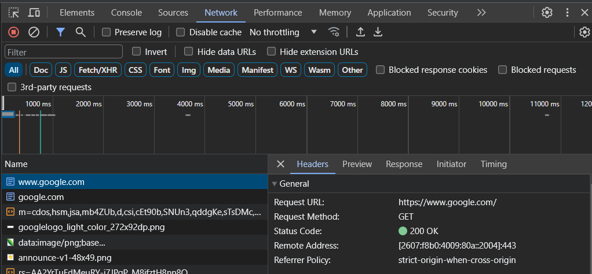

- [HTTP Status Codes](#http-status-codes)
  - [Common Status Codes for PHP:](#common-status-codes-for-php)
  - [Viewing in Developer Tools](#viewing-in-developer-tools)
- [How the PHP Interpreter Handles HTTP Status Codes](#how-the-php-interpreter-handles-http-status-codes)
  - [PHP http_response_code() Function](#php-http_response_code-function)
    - [Examples](#examples)

# HTTP Status Codes

- Sent by the server to the client in the response header.
- Used to indicate the status of a request.
- Default status code is 200 (OK).
- See [HTTP response status codes](https://developer.mozilla.org/en-US/docs/Web/HTTP/Status)

## Common Status Codes for PHP:

| Code | Description           |
| ---- | --------------------- |
| 200  | OK                    |
| 301  | Moved Permanently     |
| 307  | Temporary Redirect    |
| 400  | Bad Request           |
| 401  | Unauthorized          |
| 403  | Forbidden             |
| 404  | Not Found             |
| 500  | Internal Server Error |

## Viewing in Developer Tools

- In your browser, open Developer Tools (usually F12 or use the menu).
- Click on the Network tab.

<figure>
    <span>
        
    </span>
    <figcaption>
        <p>Dev Tools</p>
    </figcaption>
</figure>

# How the PHP Interpreter Handles HTTP Status Codes

- Default status code is 200.
- Can be changed with the `header()` function.
- Must be called before any output is sent to the client.

## PHP http_response_code() Function

- Can be used to get or set the status code.

### Examples

Redirect the user to a login page if they try to access a page that requires authentication.

```php
<?php
// User tried to navigate to a page that requires authentication...
if( !$user_is_authenticated ) {
    http_response_code(301);
    header('Location: ' . LOGIN_PAGE_URL);
    exit;
}
```

Custom 404 page.

```php
<?php
// User tried to navigate to a page that doesn't exist...
if( !$page_exists ) {
    http_response_code(404);
    header('Location: ' . 404_PAGE_URL);
    exit;
}
?>
```
