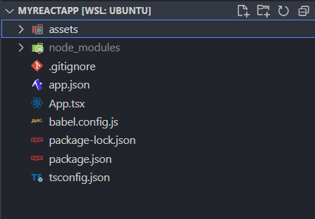

- [React Native Application Structure](#react-native-application-structure)
  - [assets](#assets)
  - [node_modules](#node_modules)
  - [.gitingore](#gitingore)
  - [app.json](#appjson)
  - [App.tsx](#apptsx)
  - [babel.config.js](#babelconfigjs)
  - [package-lock.json](#package-lockjson)
  - [package.json](#packagejson)
  - [tsconfig.json](#tsconfigjson)

# React Native Application Structure

<figure>
    
        
    
</figure>

React structure via Expo

## assets

Used to store media.

- Icons
- Images
- Fonts
- Video
- Audio

## node_modules

- Contains all the dependencies for the project.
- Packages installed put content here.
- Not manually edited.

## .gitingore

- Files and directories to be ignored by Git.
- Not specific to React Native; any Git project can have this file.

## app.json

- General configuration file with metadata for the app.
- Used when building (compiling) the app.
- Name, version, paths, etc.

## App.tsx

- Main entry point for the app.
- Actual JSX code that devs write and edit.

## babel.config.js

- Configuration JavaScript compiler, Babel.
- Not manually edited.

## package-lock.json

- Lock file for npm.
- Ensures that the same versions of packages are installed for all developers.

## package.json

- **manifest file** for the project.
- Name, version, dependencies, scripts, etc.
- `npm install`, it reads this file and installs the dependencies listed.
- `npm start` reads this file and runs the script listed.

## tsconfig.json

- TypeScript configuration file.
- Options for how TypeScript should be compiled to JavaScript.
- Not manually edited.
