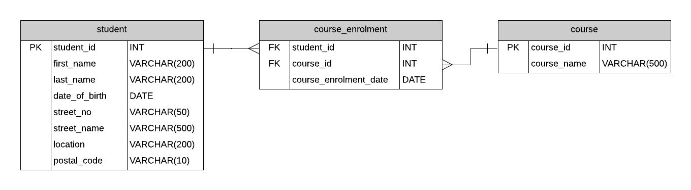

> "A database is not just a collection of data, it's a collection of answers to questions that we haven't yet thought to ask"
> -Fred Brooks, former IBM Fellow

- [Data Modeling](#data-modeling)
  - [Database](#database)
    - [Entity-Relationship Diagram (ERD)](#entity-relationship-diagram-erd)
      - [Cardinality](#cardinality)
      - [Crow's Foot Notation](#crows-foot-notation)
  - [Software Application](#software-application)
    - [Class Diagram](#class-diagram)
  - [Object-Relational Mapping (ORM)](#object-relational-mapping-orm)
    - [Case Studies](#case-studies)
      - [Example 1](#example-1)
      - [Example 2](#example-2)

# Data Modeling

**Data models** are used to define and organize structured data and interfaces within a software system.

This can be in the context of:

- Database
  - Tables
  - Columns
  - Relationships
- Software application
  - API
  - User interface
- Business process (e.g. workflow)
  - Data exchange format
- System architecture (e.g. network)
  - Data flow
  - Data storage components
  - Data processing components

In this section we will focus on the interface between a database and a software application.

## Database

### Entity-Relationship Diagram (ERD)

- Used to model relationships between entities _in a database_.
- Entities are represented as tables.

#### Cardinality

**Cardinality** describes the relationship between entities.

| Cardinality | Description  |
| ----------- | ------------ |
| 1:1         | One-to-one   |
| 1:N         | One-to-many  |
| M:N         | Many-to-many |

- 1:1 relationship
  - Zero or one instance of entity A can be associated with zero or one instance of entity B.
  - Zero or one instance of entity A can be associated with zero or one instance of entity A.
  - E.g.:
    - One person has one passport.
    - One passport belongs to one person.
- 1:N relationship
  - For one instance of entity A there exists zero to many instances of entity B.
  - For one instance of entity B there exists zero or one instance of entity A.
  - E.g.:
    - One department has many employees.
    - One employee belongs to one department.
- M:N relationship
  - For one instance of entity A there exists zero to many instances of entity B.
  - For one instance of entity B there exists zero to many instances of entity A.
  - E.g.:
    - One student can take many courses.
    - One course can have many students.

#### Crow's Foot Notation

**Crow's Foot Notation** is a visual representation of cardinality.

~~fig(90){images/crows_feet.png}

Exercise:

Use Crow's Foot Notation to model some of the above relationships.

## Software Application

### Class Diagram

~~fig(100){https://www.drawio.com/assets/img/blog/class-diagram-example.png}

Shows:

- Classes in a system
- Attributes and methods of classes
- Relationships between classes

## Object-Relational Mapping (ORM)

**Object-Relational Mapping (ORM)** is a programming technique that converts data between incompatible type systems in object-oriented programming languages.

Most often used to map a relational database to an object-oriented programming language.

 

_Typical case, retrieval:_

- Software application queries a database.
- Database returns data in a tabular format.
- ORM converts this data into objects that can be used in the application.

 

_Typical case, storage:_

- Software application creates or updates an object.
- ORM converts this object into a format that can be stored in a database.
- Database stores this data in a tabular format.

### Case Studies

#### Example 1

Simple one-to-one mapping for each field.

| Table.Field       | Object.Attribute  |
| ----------------- | ----------------- |
| Person.id         | Person.id         |
| Person.first_name | Person.first_name |
| Person.age        | Person.age        |

#### Example 2

Each person can have multiple addresses; e.g. shipping, billing, home, work.

Person class has a dictionary of addresses - one per type.

 

Walkthrough:

Draw ERD and class diagram for the following entities.

| Table.Field       | Object.Attribute  |
| ----------------- | ----------------- |
| Person.id         | Person.id         |
| Person.first_name | Person.first_name |
| Person.age        | Person.age        |
| NA                | Person.addresses  |

| Table.Field              | Object.Attribute   |
| ------------------------ | ------------------ |
| PersonAddress.id         | PersonAddress.id   |
| PersonAddress.type       | PersonAddress.type |
| PersonAddress.person_id  | NA                 |
| PersonAddress.address_id | NA                 |

| Table.Field    | Object.Attribute |
| -------------- | ---------------- |
| Address.id     | Address.id       |
| Address.street | Address.street   |
| Address.city   | Address.city     |
| Address.zip    | Address.zip      |

Demo:

[Python OCR Demo](https://github.com/mpjovanovich/python_ocr_demo)
