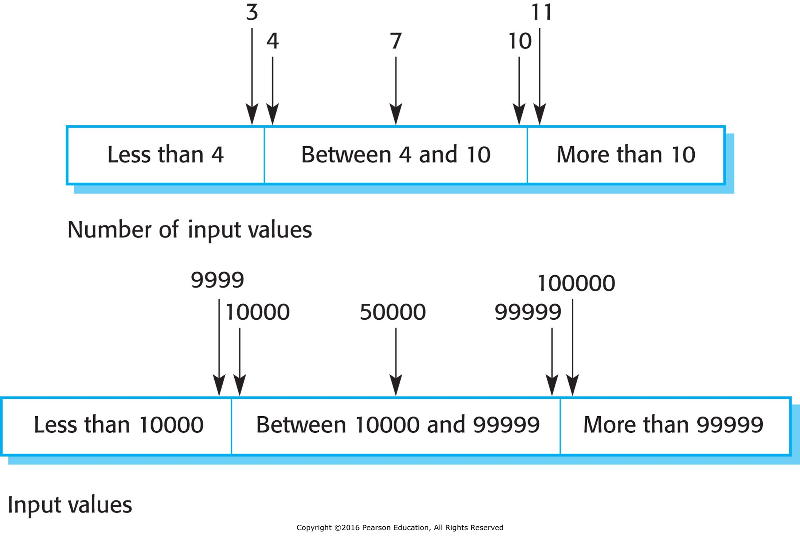

- [Development Testing](#development-testing)
  - [Unit Testing](#unit-testing)
    - [Parts of a Unit Test](#parts-of-a-unit-test)
    - [Configuring Initial State](#configuring-initial-state)
    - [Choosing Test Cases](#choosing-test-cases)
    - [Partition Testing](#partition-testing)
    - [Path Testing](#path-testing)
  - [Component Testing](#component-testing)
    - [Interface Errors](#interface-errors)
    - [Timing Errors](#timing-errors)
  - [You Can't Catch Em All](#you-cant-catch-em-all)

# Development Testing

- Done as the program is built.
- Usually done by individual programmer, or paired with product support team member.
- Testing methodologies vary in degree of formality:
  - **Ad hoc testing:** No formal test plan.
  - **Test driven development (TDD):** Write tests before writing code.
  - Anywhere in between.

## Unit Testing

<figure>
    
        
    
</figure>

- Tests individual components of the software (e.g. functions, classes).
- Automated tests run when code is compiled.

### Parts of a Unit Test

1. Setup
   - Define inputs
   - Define expected outputs (results)
   - Initialize state
2. Execution
   - Run the code
3. Verification
   - Assert that actual outputs match expected outputs

Valid input -> Expected result (e.g. return value)

Invalid input -> Expected result (e.g. error message)

### Configuring Initial State

**Test-harness:** Program that simulates conditions required for a test.

Sometimes hard to simulate a real test case:

- Data (e.g. what will really be in the database)
- System load
- Network latency
- External components
- Incomplete components

**Mocking:** Replace real objects with "mock" objects.

- Subset of data to simulate real data
- Simulate network latency or delays
- Simulate responses from external components
- etc.

### Choosing Test Cases

**Normal path:** Test cases that should work.

**Edge cases:** Test cases that are at the limits of what the software can handle.

### Partition Testing

**Partitions:** groups of inputs that should behave the same way.

- Numeric: positive, negative, zero
- String: empty, one character, many characters
- Data set: empty, one record, many records
- Categorical: one from each category (admin vs non-admin, etc.)

<figure>
    
        
    
</figure>

Divide input space into partitions and test one input from each partition. Include both valid and invalid inputs.

Edge cases are often at the boundaries of partitions.

### Path Testing

- Test every possible **path of execution** through the code.
- All logical branches are tested; all conditional statements.
- May be impossible to test every path.
- Devs can help identify partitions b/c they know the code.

## Component Testing

Focuses on how a component interacts with other components in the system.

### Interface Errors

An **interface** is a boundary between two components.

Changes in one interface can cause failures in upstream or downstream components.

Possible interface errors:

- Function calls
  - Wrong number of arguments
  - Wrong data types used
  - Wrong position of arguments
  - Null or empty arguments not handled
- Web service calls (JSON, XML, etc.)
  - Bad format
  - Missing data
- Database calls (SQL, NoSQL, etc.)
  - Missing column or extra column
  - Wrong data type

Devs could make incorrect assumptions about:

- Return values
- Error handling
  - e.g. return magic value (-1, empty string, null) or throw an exception?

### Timing Errors

Often manifest as intermittent failures that cannot be reproduced by devs.

Can occur in parallel processing, distributed systems, etc.

Can be caused by:

- Component communication
  - Network latency
  - Timeouts
- Resource deadlocks
  - Database queries trying to update the same table
  - Processes trying to write to same file
  - Processes trying to check out memory

Can try to:

- Add logging messages
- Use profilers
- Stress test; try to overload the system

## You Can't Catch Em All

"I swear it worked when I tested it!"

- **Emergent properties:** Properties that arise from the interaction of components.
- Impossible to test every possible combination of inputs.
- Often can't test at scale.
- Cost vs benefit: some tests are not worth the resources.
