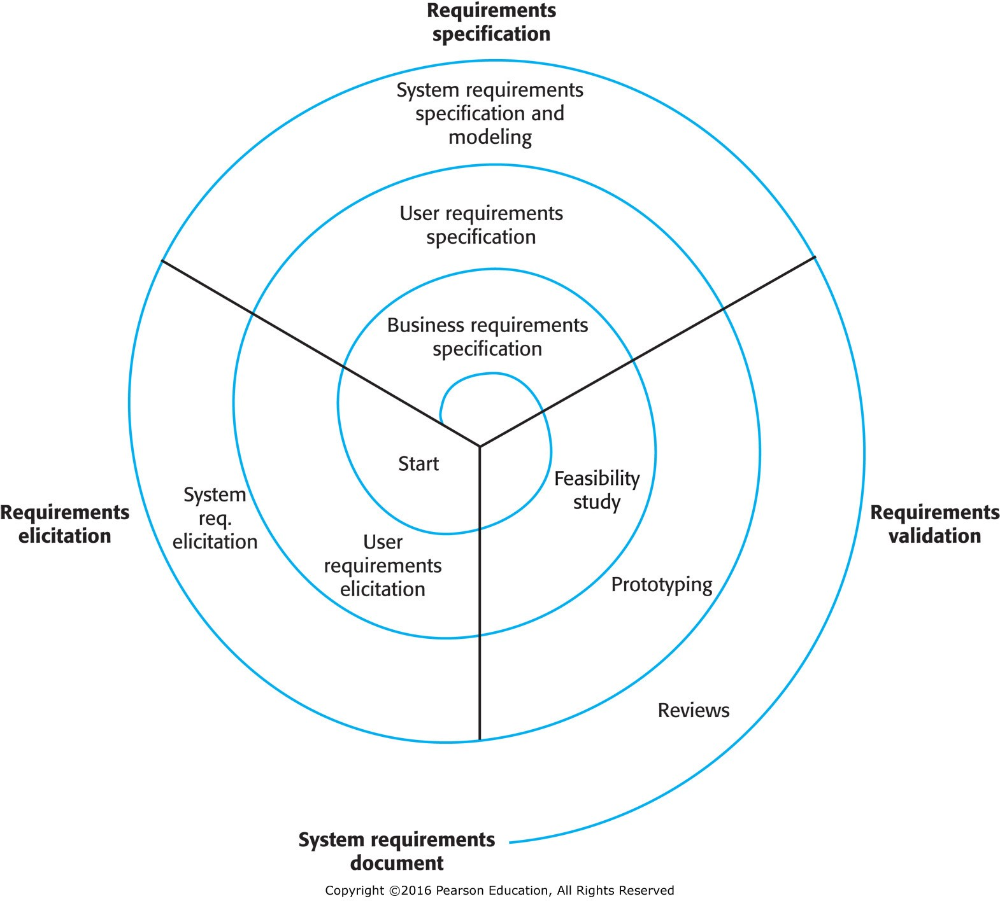

- [Requirements Elicitation](#requirements-elicitation)
  - [Techniques](#techniques)
    - [Interview](#interview)
    - [Observe](#observe)
  - [Challenges](#challenges)
    - [Stakeholder Communication](#stakeholder-communication)
    - [Environmental Factors](#environmental-factors)
    - [Domain Knowledge](#domain-knowledge)

# Requirements Elicitation

<figure>
    
        
    
    <figcaption>
        
    </figcaption>
</figure>

Below processes are iterative and interleaved.

**Stakeholders** = people who have a vested interest in the system.

- Business owners
- Contractors
- Third parties
- Users

## Techniques

### Interview

- One-on-one
- Group

### Observe

**Ethnography** - observe people in their natural environment.

Try to find: "Requirements derived from the way in which people actually work, rather than from the way in which they say they work. In practice, people never follow formal processes." (from book)

_How to observe:_

- Shadowing
- Embedded observation
- Casual social interactions (e.g. dinners, coffee)

_Examples:_

- You observe that people are using a workaround to a feature that doesn't exist, but it was not reported in requirements.
- You observe that most people are working remotely, so a feature that requires a physical presence is not worth much investment.

## Challenges

Software engineers must tactfully:

- Present options along with limitations and consequences
- Guide stakeholders toward a robust solution

### Stakeholder Communication

- Inability to articulate needs

- Competing needs.

  - Different divisions
  - Different levels of management
  - One party may prioritize a feature over another (e.g. end-user quality of life improvements)

- Failure to understand hidden feasibility barriers.

  - Hung up on a feature that's not feasible.
  - Don't understand invisible **technical debt**.

- Incomplete information
  - Only from one party / primary source
  - Only from one division
  - Only from one level of management (not seeing how it works "on the ground")

### Environmental Factors

- Cultural differences
- Political differences within the organization

### Domain Knowledge

**Domain** = the area of expertise that the software is being developed for.

Incomplete knowledge of the domain by software engineers can lead to misunderstood requirements.

- Healthcare
- Finance
- Manufacturing
- Education

**Jargon** = specialized language used by a particular group.

- Acronyms
- Specialized terms

Case Study:

**"What the heck does this 'locked' checkbox mean?"**

_Problem:_

Energy industry, different terminology by region / company:

- Fixed vs locked load

_Scenario:_

1. Software developed for Business A, who says "locked".

1. Software adapted for Business B, who says "fixed".

1. Software uses "locked" checkbox to indicate a purchased energy - Business B does not check this box.

1. Resource intensive report runs all day.

1. Customer gets aggregate report saying they have $0 invested in energy across all United States regions.

1. Ambiguously labeled checkbox leads to costly development cleanup effort (e.g. database schema changes, bad data cleanup, UI changes, etc.)

_Issues:_

- How go get requirements from multiple parties that use different terminology?
- How to sell same software to multiple parties that use different terminology?
- How to train and onboard engineers, analysts, and devs to understand the domain?
