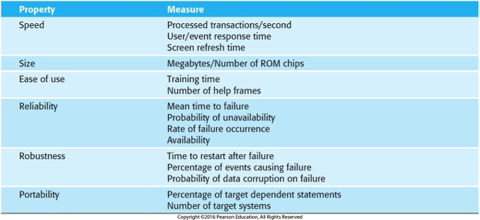

- [Requirements Sepecification](#requirements-sepecification)
  - [User Requirements](#user-requirements)
  - [System Requirements (Functional Specifications)](#system-requirements-functional-specifications)
  - [Keywords](#keywords)
  - [Natural Language vs Structured Formats](#natural-language-vs-structured-formats)
- [Functional vs Non-Functional Requirements (vs Business Rules)](#functional-vs-non-functional-requirements-vs-business-rules)
  - [Functional Requirements](#functional-requirements)
  - [Non-Functional Requirements](#non-functional-requirements)
    - [Product Requirements](#product-requirements)
    - [Organizational Requirements](#organizational-requirements)
    - [External Requirements](#external-requirements)
    - [Using Quantitative Metrics](#using-quantitative-metrics)
  - [Business Rules](#business-rules)

# Requirements Sepecification

_Reference:_

From readings...

- [NASA: How to Write a Good Requirement](https://www.nasa.gov/reference/appendix-c-how-to-write-a-good-requirement/)

## User Requirements

- High-level
- Abstract (relatively)
- Typically for non-technical stakeholders and initial planning

## System Requirements (Functional Specifications)

- Detailed
- Measurable
- Formal language

_Example:_

[NASA: Example of Functional and Performance Requirements](https://www.nasa.gov/reference/4-2-technical-requirements-definition/#hds-sidebar-nav-4)

- The TVC shall gimbal the engine a maximum of 9 degrees, ± 0.1 degree.
- The TVC shall gimbal the engine at a maximum rate of 5 degrees/second ± 0.3 degrees/second.
- The TVC shall provide a force of 40,000 pounds, ± 500 pounds.
- The TVC shall have a frequency response of 20 Hz, ± 0.1 Hz.

## Keywords

- Often use keywords to specify constraints:
  - **shall**: mandatory
  - **should**: recommended
  - **may**: optional
  - **will**: facts or declarations

## Natural Language vs Structured Formats

**Natural Language**: Simple, informal, and easy to understand. Often used for initial requirements gathering. Must common way to express requirements.

- "The system shall allow the user to log in."
- "The system should display the user's name after login."
- "The system may display a welcome message after login."

**Structured**: More formalized, with a defined structure and syntax. Often used for more detailed requirements or speficic domains.

- Follow a template.
- Can be tabular (table format) or textual.
- [NASA: GATEWAY SYSTEM REQUIREMENTS](https://ntrs.nasa.gov/api/citations/20190029153/downloads/20190029153.pdf)

# Functional vs Non-Functional Requirements (vs Business Rules)

## Functional Requirements

Describe what the system should do. Form the basis for use cases and test cases.

- "The system shall display a welcome message after login."
- "The system shall show a logout button after login."

## Non-Functional Requirements

<figure>
    
        
    
</figure>

Describe how the system should do it. Often called "constraints".

### Product Requirements

- Performance
- Reliability
- Usability
- Security

### Organizational Requirements

- Operational
- Developmental
- Environmental
- E.g.: "The C# programming language shall be used for development."

### External Requirements

- Regulatory
- Legislative
- Ethical

### Using Quantitative Metrics

<figure>
    
        
    
    <figcaption>
        
    </figcaption>
</figure>

_Avoid:_

- "The system shall be fast."
- "The system shall be secure."
- "The system shall be reliable."

_Prefer:_

- "The report shall be sent out prior to close of business, 5pm EST."
- "The email shall be sent no later than 24 hours after receiving a the request."
- "The system shall be available 99.9% of the time."
- "The system shall be able to handle 1000 concurrent users."

## Business Rules

Not the same as requirements, but similar.

_Reference:_

- [IBM: What are business rules?](https://www.ibm.com/topics/business-rules)

**Business rules** are constraints on the business that may or may not affect the system.

You may hear, "The company has a business rule that [...]".

- "Transactions of over $10,000 must be audited by two persons."
- "Invoice totals must appear on the front page of the invoice."
