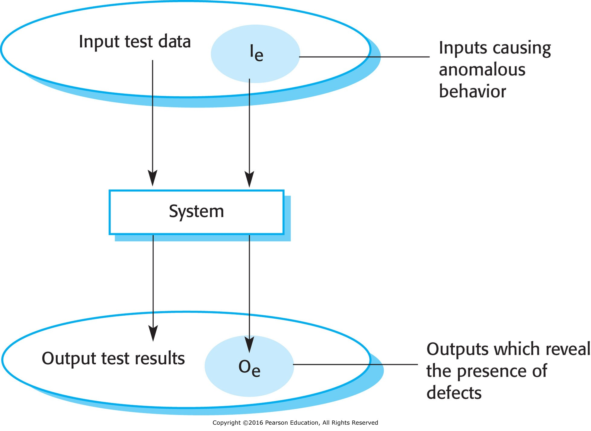

- [Software Testing](#software-testing)
  - [Validation Testing](#validation-testing)
  - [Defect Testing](#defect-testing)
  - [Stages of Testing](#stages-of-testing)

# Software Testing

Part of V&V (Verification and Validation) process.

> **Validation:** Are we building the right product?  
> **Verification:** Are we building the product right?  
> (Boehm, 1979)

## Validation Testing

Demonstrate software meets requirements. Check against functional and non-functional requirements.

## Defect Testing

Find inputs that cause software to break.

<figure>
    
        
    
</figure>

## Stages of Testing

Validation and defect testing can both be applied to the stages of software testing listed below.

- Development Testing
- Release Testing
- User Testing
