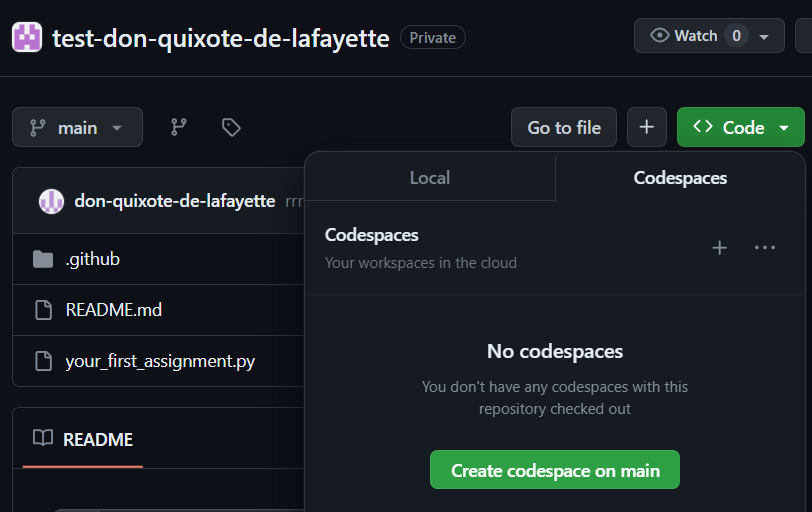
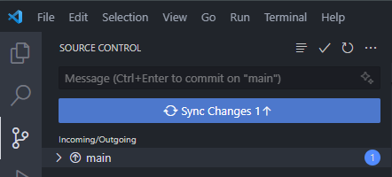
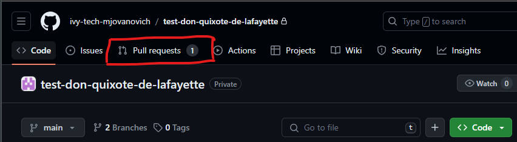

- [Git](#git)
  - [What is Git?](#what-is-git)
  - [How to Interface with Git](#how-to-interface-with-git)
    - [Graphical User Interface (GUI)](#graphical-user-interface-gui)
  - [GitHub](#github)
    - [Git Repositories](#git-repositories)
    - [GitHub Classroom Assignments](#github-classroom-assignments)
      - [Finding Repos for the Course](#finding-repos-for-the-course)
  - [GitHub Codespaces](#github-codespaces)
    - [Creating a Codespace](#creating-a-codespace)
    - [Closing a Codespace](#closing-a-codespace)
    - [Checking Your Balance](#checking-your-balance)
  - [VS Code](#vs-code)
    - [VS Code Terminal](#vs-code-terminal)
      - [Terminals and Shells](#terminals-and-shells)
    - [VS Code Source Control Panel](#vs-code-source-control-panel)
  - [Instructor Feedback for Assignments](#instructor-feedback-for-assignments)
    - [Grading Results](#grading-results)
    - [Asking for Help](#asking-for-help)

# Git

Git is a powerful tool that you'll almost certainly come across in your career.

All of the topics below are tied directly or indirectly to Git.

## What is Git?

**Git** is a program that runs on a computer. It needs to be installed like any other program:

- [Git (installation and documentation)](https://git-scm.com/)

Git is a **version control system (VCS)**:

- Stores files and their history
- Tracks changes to files over time
- Allow for point in time recovery and comparison
- Allows more than one person to work on (or examine) the same file at the same time.

## How to Interface with Git

### Graphical User Interface (GUI)

- Recommended for beginners
- GitHub via the browser
- VS Code Source Control Panel

## GitHub

<figure>
    
        
    
    <figcaption>
        
    </figcaption>
</figure>

**GitHub** is a website that hosts Git repositories.

GitHub is not the same as Git.

### Git Repositories

A **repository** is a collection of files and their history.

- Should be one repository per project.

- Roughly equivalent to a folder on your computer.

- A user can have many repositories:

Files can be uploaded to the repository via drag and drop, or the upload button:

### GitHub Classroom Assignments

- Each assignment will have a link.
- When you click the link, it will create a repository for you.

ALL REPOSITORIES FROM THE COURSE WILL BE DELETED AFTER THE COURSE HAS ENDED!

If you with to save your work you must fork your existing repository to your personal GitHub account.

#### Finding Repos for the Course

- You'll be put in an **organization** for the course.
- Click profile icon in top right, then click **Your organizations**:

- Click the organization for the course; it will have your repos.

## GitHub Codespaces

- **GitHub Codespaces** is a virtual development environment that runs in the browser.
- Run it by clicking the green button in the top right of the repository page:
- Allows you to run VS Code in the browser.
  - Uses https://vscode.dev/ - online IDE

### Creating a Codespace

- To create
  - Go to your repository
  - Click the "Code" button
  - Click the Codespaces tab

### Closing a Codespace

GitHub gives you an allocated amount of minutes to use per month. While active, codespaces will use some of your minutes.

- To close while in the Codespace
  - Bring up the command palette with `Ctrl + Shift + P`
  - Type `Codespaces: Close Current Codespace`
- To close from the repository page
  - Go to your repository
  - Click the "Code" button
  - Click the Codespaces tab
  - Delete any active codespaces
- To check if you have existing codespaces
  - Go to: https://github.com/codespaces
  - Delete any active codespaces

**As long as your code has been pushed to GitHub, it is safe (and encouraged) to close/delete a codespace whenever you're done with a work session.**

You can always start a new one.

### Checking Your Balance

- Go to https://github.com/settings/billing/summary
- Scroll down to Codespaces:

- Note that hours listed are **core hours**.
- We use 2 core machines, so 1 hour of Codespaces usage is 2 hours of core hours.
- You should have 90 hours of Codespaces usage per month.

## VS Code

<figure>
    
        
    
    <figcaption>
        
    </figcaption>
</figure>

### VS Code Terminal

#### Terminals and Shells

Git commands are in the form `git [your_command_here] --[optional_flags_here]`.

Git commands are typed into a **terminal** which runs a **shell**.

- A **terminal** provides a user interface into a shell.

  - This is what you type commands into.
  - Like the part of the car that you see and interact with.

- A **shell** is a program that executes text **commands**.

  - This is what actually runs the command.
  - Like the "engine" of a car.
  - Usually use `bash` or `zsh` shells.

The CLI for Git can be accessed in a VS Code terminal:

- `Ctrl + ~` or `View > Terminal`.

Make sure that you are in the root directory of your project:

- Use the `pwd` command to see the current directory.

Make sure that you have the correct shell selected, _bash_ or _zsh_:

### VS Code Source Control Panel

The GUI for Git can be accessed in the VS Code Source Control Panel:

- The number in the circle indicates the number of files that have been changed.
- A commit message is required before you press the button.

After committing, you can push to GitHub with the Sync button:

## Instructor Feedback for Assignments

### Grading Results

- After grading, your instructor will leave feedback on your assignment in GitHub.
- You may access this feedback via the GitHub website.
- Check the **Pull requests** tab:

- You will se general comments, and line-by-line comments.
- Comments can also be viewed in a Codespace.

### Asking for Help

If requesting help via email, it will help your instructor if you leave inline comments. You may do this by opening a Codespace and clicking the message icon to the left of the line number that you'd like to comment on:

