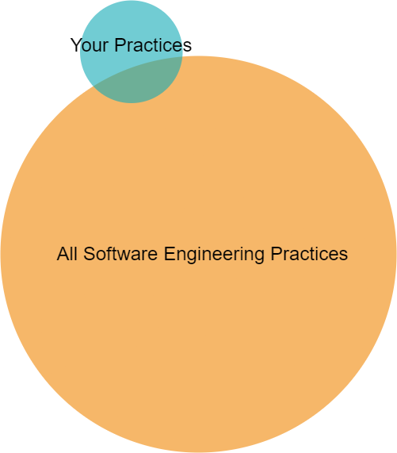
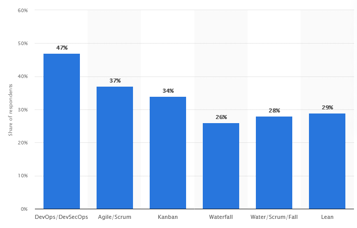

- [Software Development Life Cycle (SDLC)](#software-development-life-cycle-sdlc)
  - [Stats](#stats)
  - [Plan Driven Development](#plan-driven-development)
    - [Waterfall](#waterfall)
  - [Agile Development](#agile-development)
    - [Principles](#principles)
    - [Types of Agile](#types-of-agile)
      - [Scrum](#scrum)
      - [Kanban](#kanban)
    - [DevOps / DevSecOps](#devops--devsecops)
    - [Principles](#principles-1)

# Software Development Life Cycle (SDLC)

<figure>
    
        
    
    <figcaption>
        
    </figcaption>
</figure>

Most software development processes are a mix of established practices. The SDLC is a framework for organizing these practices.

Which proccess is best depends on the project.

## Stats

<figure>
    
        
    
</figure>

[Statistica - stats 2022](https://www.statista.com/statistics/1233917/software-development-methodologies-practiced/)

<figure>
    
        
    
</figure>

[Inixoft - stats 2023](https://inoxoft.com/blog/7-software-development-models-comparison-how-to-choose-the-right-one/)

_\*This information varies by sources and date._

Trends:

- DevOps / DevSecOps is growing, and is expected to continue growing.
- Agile is very popular.
- Waterfall has its niche.

## Plan Driven Development

In **plan driven development**, the entire process is planned out before any work begins.

**Works well when:**

- Project is simple and well understood
- Fixed requirements, timeline, budget
- High risk scenario
- Documentation is important
- Audits and accountability are important

**Examples:**

- Medical devices
- Embedded systems on cars, planes, etc.
- Financial systems
- Government software

**Advantages:**

- Clear expectations.
- Clear milestones and deliverables.
- Strong emphasis on documentation.

**Disadvantages:**

- Application not available until the end of the process.
- Teams are siloed; lack of communication.
- Bottlenecks between phases due to lack of overlap.
- Not flexible. Changes are difficult and expensive, especially late in the process.

### Waterfall

<figure>
    
        
    
</figure>

Focused on delivering a single application.

## Agile Development

<figure>
    
        
    
</figure>

In **agile development**, software is developed in short iterations. Each iteration is a complete development cycle, from planning to deployment.

These methodologies are also used in other industries, such as manufacturing.

**Works well when:**

- Requirements are flexible
- Close relationship between developers and stakeholders
- Able to receive feedback and respond quickly
- Teams are small and can be cross-functional

**Examples:**

- Business software
- Data analytics tooling
- Web development
- Mobile apps

**Advantages:**

- Application is available early in the process.
- Higher client and customer satisfaction.
- Build relationships with clients and customers.
- Changes are easy and inexpensive.

**Disadvantages:**

- Less documentation.
- Less accountability.
- Less predictability.

### Principles

_Agile Manifesto:_

- Individuals and interactions over processes and tools
- Working software over comprehensive documentation
- Customer collaboration over contract negotiation
- Responding to change over following a plan

### Types of Agile

Many principles and practices overlap between these methodologies.

#### Scrum

<figure>
    
        
    
    <figcaption>
        Clients and stakeholders after meeting with development project manager.
    </figcaption>
</figure>

Popular in software and manufacturing.

**Sprints**

- Iterations with clear goals, start and end dates
- Usually 2-4 weeks

**Daily standups**

- 15 minute meeting
- Identify blockers

**Backlog**

- List of tasks to be completed
- Prioritized by importance
- Tasks are assigned to sprints

#### Kanban

<figure>
    
        
    
    <figcaption>
        
    </figcaption>
</figure>

Work is assigned (from backlog) only when there is capacity to complete it.

- Visual workflow
  - Kanban board (sticky note board)
  - Swimlanes
- Limit work in progress

### DevOps / DevSecOps

Focuses on use of automation and collaboration between teams.

**DevOps** is a combination of development and operations.
**DevSecOps** is a combination of development, security, and operations. Brings focus to security throughout the process.

| Domain      | Activities                                        |
| ----------- | ------------------------------------------------- |
| Development | Design, develop, test                             |
| Operations  | Deploy, monitor, scale, maintain                  |
| Security    | Assess risk, penetration testing, threat modeling |

_\*Testing spans multiple domains._

**Works well when:**

- Very large projects
- Multiple teams
- Multiple applications
- Multiple environments

**Examples:**

- Large enterprise software
- Large scale distributed applications

**Advantages:**

- Focus on reliability and security
- Fast development, deploymentment, feedback
- Avoid lag where there is handoff between teams, e.g.:
  - Waiting for operations to deploy
  - Waiting for security to approve
  - Waiting for new requirements

**Disadvantages:**

- Requires expertise to implement.
- Requires buy-in from all teams.
- May not be appropriate for small projects / teams / businesses.

### Principles

- Product is a living process.
- Rapid feedback loops.
- Continuous integration (CI)
- Continuous delivery (CD)

Demo:

GitHub Actions - build and deploy process.

- GitHub project: https://github.com/mpjovanovich/ivy_tech/tree/main/docs
- GitHub pages site: https://mpjovanovich.github.io/ivy_tech/
- Pages settings: https://github.com/mpjovanovich/ivy_tech/settings/pages
- Build history: https://github.com/mpjovanovich/ivy_tech/actions

Let's try breaking it by putting a typo on the theme for the \_config.yml file.

- New theme: https://github.com/pages-themes/architect

... could have avoided the break if there were tests in our CI/CD pipeline.
